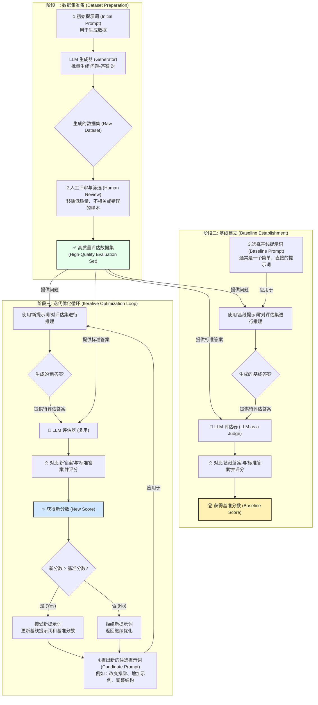

## 从“炼丹”到工程：构建可量化、可迭代的提示词工程体系

在大型语言模型（LLM）应用的开发浪潮中，提示词工程（Prompt Engineering）已从一门“玄学艺术”迅速演变为一门核心工程学科。然而，许多团队仍停留在依赖直觉、手动试错的“炼丹”阶段，这种方式不仅效率低下，更缺乏可复现性与可扩展性。本文旨在总结**评估驱动（Evaluation-Driven）** 的系统化框架，将提示词开发转变为一个可量化、可迭代、可协同的工程流程，并介绍一套完整的开源工具链，帮助资深工程师构建更稳健、更高效的LLM应用。

### 1. 核心理念：告别直觉，拥抱评估驱动开发（EDD）

对于有经验的工程师而言，我们都曾经历过那个瞬间：凭感觉修改了一个提示词，输出似乎“变好了”。但问题随之而来：

*   “好”了多少？是全面提升还是仅仅在几个样本上表现更佳？
*   这次修改是否在其他我们未关注的方面引入了新的问题（即“回归”问题）？
*   当团队成员对“好”的标准有分歧时，如何决策？

这些问题的根源在于缺乏一个客观的度量衡。借鉴软件工程中“测试驱动开发”（TDD）的思想，我们引入 **“评估驱动开发”（Evaluation-Driven Development, EDD）** 作为提示词工程的核心理念。其根本原则是：**无法量化的，就无法优化。**

EDD要求我们在优化任何提示词之前，首先建立一个稳定、可靠的评估基准。后续所有的修改都必须通过与该基准进行量化对比来验证其有效性，从而将主观判断转变为数据驱动的决策。

### 2. 系统化流程：三阶段闭环方法论

一个完整的、可工业化的提示词工程流程可被拆解为三个核心阶段，形成一个持续优化的闭环。

#### **阶段一：铸造黄金评估集——定义“好”的唯一标准**

评估的质量上限取决于评估集的质量。一个高质量的评估集（黄金集）是整个流程中最宝贵的资产，是定义“好”的唯一事实来源。
*   **AI辅助生成**：为了提升效率，我们可以使用一个强大的LLM（如GPT-4）配合结构化输出指令（例如，使用Pydantic模型与LangChain的`PydanticOutputParser`），批量生成“输入-理想输出”对。这为我们提供了丰富的原始素材。
*   **人工审核与精炼**：AI生成的数据绝不能直接使用。必须由领域专家进行严格审核，修正错误、剔除低质样本、补充边缘案例，确保数据集的**准确性、多样性和任务覆盖度**。这一步是确保评估有效性的关键。

#### **阶段二：建立量化基线——科学的对照组**

在没有参照物的情况下，任何改进都是空谈。
*   选择一个简单、直接的提示词作为**基线提示词**。
*   使用该提示词处理黄金评估集中的所有输入，得到一批“基线答案”。
*   引入**LLM-as-a-Judge**模型，让它对比“基线答案”和“理想输出”，并给出一个量化分数。对所有样本评分取平均，得到**基准分数**。这个分数就是我们未来所有优化的衡量标尺。

#### **阶段三：假设驱动的迭代循环——实现可度量的持续改进**

这一步将“凭感觉改”提升为“做实验”，实现可度量的持续改进。
*   **提出优化假设**：不要随机修改，而是提出一个明确的假设。例如：“我假设，通过在提示词中加入‘一步一步思考’的指令（Chain-of-Thought），可以提升模型在数学应用题上的得分。”
*   **创建候选提示词**：根据假设设计新的提示词。
*   **实验与度量**：使用新提示词重复阶段二的评估流程，得到一个**新分数**。
*   **决策与更新**：
    *   如果新分数显著高于基准分数，则假设得到验证。接受新提示词作为新的基线，并更新基准分数。
    *   如果分数没有提升甚至下降，则拒绝该修改，返回并提出新的假设。

这个循环确保了每一次迭代都是有目的、有度量的，并且能够稳定地累积进展。

### 3. 工具链赋能：从理念到实践

理论需要工具来落地。以下是一套经过验证的开源工具链，可以支撑上述完整流程：

1.  **数据生成与结构化**：**LangChain / LlamaIndex**
    *   利用其强大的组件（如`OutputParsers`）和与各类模型的集成能力，高效、稳定地生成结构化的初始数据集。

2.  **人工审核与标注**：**Label Studio / Argilla**
    *   **Label Studio** 提供了高度可定制的标注界面，非常适合创建复杂的审核任务（如并排对比、多维度打分）。
    *   **Argilla** 则更侧重于NLP任务的快速反馈和团队协作，界面清爽，与Hugging Face生态结合紧密。
    *   它们都能帮助您将AI生成的原始数据，高效地转化为黄金评估集。

3.  **评估与比较**：**Promptfoo**
    *   这是执行阶段二和阶段三的核心工具。通过简单的YAML配置，您可以定义多个提示词、多个模型提供商以及包含标准答案的测试用例。
    *   运行一条命令，Promptfoo即可自动化完成所有组合的测试，并生成一个直观的Web界面，并排比较不同版本的得分和具体输出，让优劣一目了然。

### 4. 进阶思考：给资深工程师的挑战

当您熟练掌握上述流程后，可以从以下几个方面进行更深入的优化：

*   **评估集分层与切片 (Evaluation Set Slicing)**：不要满足于一个总分。将您的黄金评估集根据难度、任务类型（如：简单查询、逻辑推理、代码生成）等维度进行切片。一个新提示词可能提升了总分，却在某个关键子集上造成了性能衰退。分层评估能帮您发现这些细微变化。
*   **建立自动化回归测试集**：在黄金评估集中，特别标记出一批“红线”案例（即无论如何都不能出错的案例）。每次迭代后，除了关注总体分数提升，还需确保新提示词在这些红线案例上的通过率是100%。这能有效防止“按下葫芦浮起瓢”的现象，确保核心功能的稳定性。
*   **LLM-as-a-Judge的局限性与对策**：作为评估器的LLM本身也存在偏见（如位置偏见、倾向于更长的回答等）。可以通过使用更强的模型作为裁判、交叉使用不同公司的模型进行评估、或者设计更具鲁棒性的评分标准来缓解这些问题。
*   **性能、成本与延迟的权衡三角**：一个得分最高的提示词，可能因为它更长或触发了更复杂的思考链，而导致更高的API调用成本和更长的响应延迟。在生产环境中，最优的提示词是在**性能、成本、延迟**三者之间取得最佳平衡的那个，而不是单纯的最高分。
*   **将评估流程集成到CI/CD管道**：对于追求极致工程化的团队，可以将Promptfoo或类似的评估工具集成到CI/CD流程中。当工程师提交一个新的提示词版本时，系统可自动触发评估流程，并将分数报告直接附在代码合并请求（Pull Request）中。只有当新提示词的分数不低于当前基线时，才允许合并，这实现了提示词质量的自动化卡控。

### 结论

提示词工程的未来，必然是向着更系统、更科学、更自动化的方向发展。通过采纳评估驱动开发的理念，建立一套从黄金数据集构建，到量化基线评估，再到假设驱动迭代的系统化流程，并借助LangChain、Label Studio、Promptfoo等现代化开源工具链，我们可以将提示词开发从不确定的“炼丹术”转变为一门可靠的工程学科。这不仅能显著提升开发效率和应用质量，更是构建复杂、可信赖AI应用的核心竞争力所在。

**欢迎关注+点赞+推荐+转发**