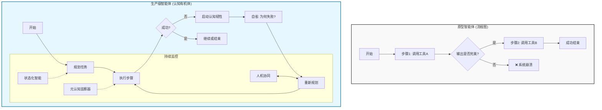

# **智能体鸿沟：从LangGraph原型到生产级AI智能体的认知跃迁**

### 引言：从“Hello World”的兴奋到“智能体鸿沟”的现实

对于踏入AI智能体领域的开发者，LangGraph等框架描绘了一幅令人心驰神往的前景：通过图形化的编排，将大型语言模型（LLM）、工具与逻辑串联，似乎就能轻易创造出功能强大的智能体。当第一个能检索网页、回答问题的“Hello World”智能体成功运行时，那种创造的喜悦是真实而澎湃的。然而，这股初期的兴奋感，往往迅速被一个冰冷的现实所取代：一个脆弱的原型与一个能在真实世界中稳健运行、创造价值的生产级智能体之间，存在着一道难以逾越的鸿沟。

这道 **“智能体鸿沟”**，其根源并非工具之过，而是范式之误。我们必须认识到，构建生产级智能体，不再是编写一段确定性的流程图代码，而是**在工程上缔造一个具备韧性的“认知有机体”**。

本文旨在解构这道鸿沟，并总结这种心智模型转变。我们将深入剖析从一个脆弱原型演进为一个可靠生产系统所必需的四大核心支柱，引领开发者完成从“流程执行者”到“认知架构师”的思维跃迁。

### 核心范式转移：告别“流程图”，拥抱“认知有机体”

原型智能体，其行为模式如同一个僵化的**流程图**，它只能在预设的“理想路径”（Happy Path）上机械执行。它假设所有API调用都会成功，所有LLM输出都格式完美，所有上下文都清晰无误。然而，现实世界充满了混沌与不确定性——一次API超时、一个微小的JSON格式错误、一次用户意图的偏离，都足以让整个流程图瞬间崩溃。

与之形成鲜明对比的，是一个生产级的**认知有机体**。它被设计用来在混乱中生存、在不确定性中导航。它必须拥有处理逆境的 **“免疫系统”**、维持上下文连贯性的 **“记忆与专注力”**、用于自我审视和规划的 **“内在意识流”**，以及与人类无缝协作的 **“社会智能”**。跨越智能体鸿沟的桥梁，正是由以下四大支柱所构建。

<br>


<br>

### 支柱一：认知韧性 —— 智能体的“免疫系统”

生产级系统的决定性特征，是其抵御失败并从中恢复的内在能力。这远远超越了简单的`try-except`代码块，它是一种架构级的免疫力。

*   **原型方法：** 工具调用失败，智能体崩溃或返回一个无用的通用错误。
*   **生产级方法：** 韧性被内建于智能体的“基因”之中。
    *   **自省式纠错循环：** 当工具调用失败时，智能体并非直接放弃，而是进入一个“自省节点”。它会反思：“失败的根源是什么？是我的参数有误，还是工具暂时不可用？我应该修正参数重试，切换备用工具，还是重新规划整个任务？” 这要求在图中设计专门的**反思与重规划逻辑**。

    ```mermaid
    graph TD
        A[调用工具] --> B{调用失败?};
        B -- 否 --> C[继续任务];
        B -- 是 --> D[进入自省循环];
        D --> E[分析失败原因<br>e.g., 参数错误, API超时];
        E --> F{选择策略};
        F -- 修正参数 --> A;
        F -- 切换工具 --> G[调用备用工具];
        F -- 重大问题 --> H[请求人工干预];
        G --> B;
    ```

    *   **优雅降级与边界意识：** 智能体深刻理解自身能力的边界。当一个复杂任务被证明无法独立完成时，它不会陷入无尽的失败循环，而是会完成力所能及的部分，清晰地向用户沟通其局限性（“我已经完成了数据分析，但无法生成最终图表”），并优雅地将控制权移交给人类（Human-in-the-Loop）。
    *   **健壮的输入/输出解析层：** 绝对不能盲目信任LLM的输出。生产级智能体必须包含一个 **“格式验证与修复层”**，如同一个防火墙。如果LLM返回的JSON格式不正确，该层会捕获异常，并携带具体的错误信息，指示LLM自行修复其输出。这能有效隔离LLM的概率性风险，保护系统核心逻辑的稳定性。

### 支柱二：状态化智能 —— 智能体的“记忆与专注”

原型智能体常患有“认知失忆症”，在多轮交互或复杂任务中轻易忘记最初的使命。生产级智能体必须具备强大的**认知耐力**，能够主动管理和维持一个连贯、持久的状态。

*   **原型方法：** 将所有历史记录粗暴地塞入上下文窗口，直至其不堪重负。
*   **生产级方法：** 智能体像管理自身精力一样，主动管理其认知资源。
    *   **动态上下文管理：** 上下文窗口被视为宝贵且有限的“工作记忆”。智能体必须拥有高效的机制来**总结、压缩和分层**信息，区分出作为核心使命的“长期记忆”和处理当前步骤的“短期记忆”。
    *   **元认知监察器：** 为防止智能体陷入两个状态间的“认知空转”或无休止的循环，引入一个“元认知监察器”节点至关重要。它不执行具体任务，而是作为“旁观者”监控状态转换历史。一旦检测到重复循环或异常长的执行路径，它会强制介入，触发重规划或请求人类协助，打破思维定势。

    ```mermaid
    graph TD
        subgraph "执行流"
            StateA[状态A: 搜索信息] --> StateB[状态B: 分析信息];
            StateB --> StateA;
        end

        subgraph "监控流"
            Monitor[元认知监察器] -- 观察 --> StateA;
            Monitor -- 观察 --> StateB;
            Monitor --> Check{检测到循环?};
            Check -- 是 --> Intervene[强制干预: 重规划/求助];
            Check -- 否 --> Monitor;
        end
    ```

    *   **认知锚定：** 在每一个决策点，智能体都必须重新锚定其最终目标。这通过在决策提示（Prompt）中始终注入一个浓缩的核心任务描述来实现。这种机制确保了智能体在深入复杂的子任务时，不会因“目标漂移”而迷失方向。

### 支柱三：透明可观测性 —— 解剖智能体的“意识流”

当原型失败时，其内部过程如同一个无法探查的黑箱，开发者只能靠猜测来调试。生产级系统必须是思想透明的，允许我们深入其内部，观察并理解其“思考”的全过程。

*   **原型方法：** 依赖零散的`print()`语句进行盲人摸象式的调试。
*   **生产级方法：** 智能体的推理路径是完全暴露、可追溯、可分析的。
    *   **认知轨迹追踪 ：** LangSmith这类工具是必备的“CT扫描仪”。它们提供了智能体完整认知旅程的可视化记录：每一次提示、每一次LLM的推理、每一次工具的选择、每一次状态的变迁。这使得开发者能像外科医生一样，精准定位失败是源于规划缺陷、工具误用，还是模型幻觉。
    *   **量化评估框架 ：** “感觉效果不错”是生产环境的毒药。必须建立一个包含多样化测试用例的评估数据集和明确的成功指标（如：任务成功率、工具调用效率、Token成本、用户满意度）。对智能体的任何架构或提示的修改，都必须通过这个框架的严格检验，以数据驱动的方式确保真正的进步。
    *   **资源代谢效率：** 生产级智能体必须具备成本和性能意识。通过设计一个智能的 **“模型路由”** 节点，智能体可以根据任务的复杂性，动态选择最合适的LLM——用廉价、高速的模型处理简单分类，用昂贵、强大的模型进行深度推理。这是智能体高效利用资源的体现。

    ```mermaid
    graph TD
        Input[输入任务] --> Router{任务复杂度分析};
        Router -- 简单/常规 --> FastLLM[⚡️ 调用快速/廉价模型<br>e.g., Haiku, Llama3-8B];
        Router -- 复杂/需推理 --> PowerfulLLM[🧠 调用强大/昂贵模型<br>e.g., Opus, GPT-4o];
        FastLLM --> Output[输出结果];
        PowerfulLLM --> Output;
    ```

### 支柱四：人机共生 —— 从“自主工具”到“认知伙伴”

在绝大多数有价值的复杂场景中，追求一个100%全自主的智能体不仅不切实际，而且极其脆弱。最强大、最可靠的智能体，是被设计成与人类协同进化的**认知伙伴**，而非一个孤立的黑箱工具。

*   **原型方法：** 智能体从头跑到尾，要么成功，要么失败，人类无法介入。
*   **生产级方法：** 智能体的架构为无缝的人机协作而生，追求一种**引导式自主**。
    *   **可干预与可修正性：** 系统必须在关键决策点为人类敞开大门。用户应能随时暂停智能体，审查其行动计划，提供修正反馈（“不，不要用这个API，用另一个”），或在执行高风险操作（如删除数据、发送邮件）前进行最终审批。

    ```mermaid
    sequenceDiagram
        participant User
        participant Agent
        participant Tools

        Agent->>User: 这是我的行动计划，是否批准？
        User->>Agent: 批准，但请在执行前确认。
        Agent->>Tools: 执行操作A...
        Tools-->>Agent: 操作A完成。
        Agent->>User: 操作A已完成。下一步计划是...
        User->>Agent: 暂停！修改下一步计划，改为操作C。
        Agent->>User: 收到。已更新计划。
    ```

    *   **建立共享心智模型 ：** 最好的智能体会“思考出声”。它会主动沟通其意图（“我现在的计划是先分析报告，再查找销售数据”）、其行动（“正在调用数据库工具，查询语句如下……”）及其不确定性（“我对这个结果的置信度是70%”）。这种透明的沟通，能与用户建立起深刻的信任和可预测性，形成一个强大的“人机混合智能”。

### 结论：你的新角色——认知架构师

智能体鸿沟，归根结底，不是一个编码挑战，而是一个**工程哲学与系统架构**的挑战。从一个LangGraph原型走向一个生产级的AI智能体，其本质是一次深刻的身份转变：**你不再是编写确定性指令的程序员，而是设计弹性、有状态、可协同的认知系统的架构师。**

通过精心构筑**认知韧性、状态化智能、透明可观测性**和**人机共生**这四大支柱，你将不再仅仅是在图中连接节点，而是在为这个图注入生命力，为其谱写定义稳健智能的**基因蓝图**。

**欢迎关注+点赞+推荐+转发**