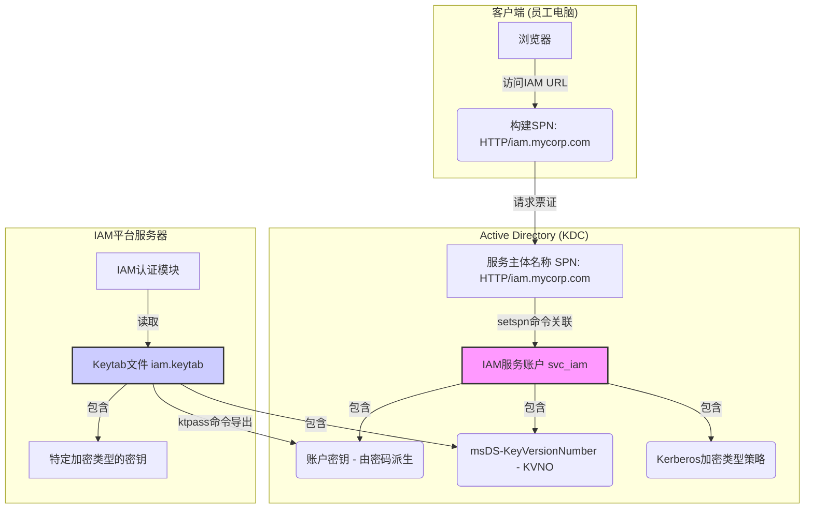
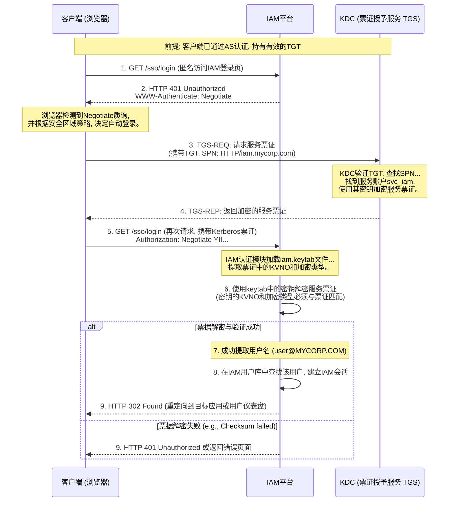

## **第31篇：【解决方案】无缝SSO：IAM平台如何集成Kerberos认证**

### **导言**

在企业内部网络中，员工早已习惯于“登录一次Windows，畅行所有内部应用”的无缝体验。这种便捷、安全的单点登录（SSO）背后，正是由Kerberos协议所驱动的集成Windows认证（Integrated Windows Authentication, IWA）。对于任何希望在企业内部落地并提供卓越用户体验的IAM/IDaaS平台而言，能否完美地继承和利用现有的Kerberos体系，是其成功的关键试金石。

现代IAM平台并非要取代Kerberos，而是要**与之深度集成，强强联合**。通过集成，IAM可以：

*   **实现真正的无缝桌面SSO：** 用户在访问受IAM保护的应用时，无需再次输入任何密码。
*   **将Kerberos认证与现代安全能力结合：** 在Kerberos认证成功后，可以叠加MFA、风险评估等高级策略。
*   **桥接传统与现代：** 将Kerberos认证的信任，传递给使用SAML、OIDC等现代协议的云应用。

本章将深入剖析IAM平台集成Kerberos认证的完整解决方案，从核心原理、配置要点到认证流程，为您提供一个从架构到实践的完整指南。

### **一、 核心原理：IAM在Kerberos生态中的角色**

要理解集成，首先要明确IAM平台在Kerberos认证流程中所扮演的角色。

**核心角色回顾：**

*   **客户端 (Client):** 员工的Windows域成员计算机。
*   **密钥分发中心 (KDC):** Active Directory域控制器（DC）。
*   **服务 (Server):** 在此场景下，**IAM平台本身就是那个需要被访问的服务**。

**核心凭据：**

*   **票证授予票证 (TGT):** 员工登录Windows时，由KDC颁发给客户端的“身份凭证”。
*   **服务票证 (Service Ticket):** 客户端使用TGT向KDC申请的、**专门用于访问IAM平台**的“访问门票”。

**集成关系总览图：**

*此图清晰地展示了IAM平台作为Kerberos服务端的配置关系。关键在于，IAM平台需要一个在AD中对应的服务账户（`svc_iam`），并持有该账户密钥的副本（`iam.keytab`），以便能够解密由KDC颁发的、发往IAM的服务票证。*

### **二、 配置阶段：建立IAM与AD之间的信任**

正确的配置是实现无缝SSO的前提。

#### **1. 服务主体名称 (SPN) 的注册**

SPN是IAM平台在Kerberos世界中的唯一身份标识。

*   **配置命令:** `setspn -A HTTP/iam.mycorp.com svc_iam`
*   **参数作用:**
    *   `HTTP/iam.mycorp.com`: 客户端浏览器会根据访问的IAM平台URL自动构建此SPN。
    *   `svc_iam`: KDC（AD）会使用`svc_iam`这个账户的密钥来加密发往IAM的服务票证。
    *   **要点：** SPN必须在整个AD林中唯一，使用`setspn -X`检查。

#### **2. IAM服务账户的Kerberos属性配置**

在AD中，为`svc_iam`账户配置正确的加密策略至关重要。

*   **配置位置:** Active Directory 用户和计算机 -> `svc_iam`账户属性 -> “帐户”选项卡。
*   **参数作用:**
    *   **勾选 `该帐户支持 Kerberos AES 256 位加密`**: 强烈建议使用AES等强加密算法，这要求KDC和IAM平台都支持。
    *   **`msDS-KeyVersionNumber` (KVNO):** 密钥版本号，每次重置账户密码时都会增加。

#### **3. Keytab文件的生成与部署**

Keytab文件是服务账户密钥在IAM平台服务器端的安全副本。

*   **配置命令:** `ktpass /out iam.keytab /princ HTTP/iam.mycorp.com@MYCORP.COM /mapuser MYCORP\svc_iam /crypto AES256-SHA1 /pass <Password> /ptype KRB5_NT_PRINCIPAL`
*   **参数作用:**
    *   `/out iam.keytab`: 生成的密钥文件。
    *   `/princ ...`: 指定SPN。
    *   `/mapuser ...`: 指定要导出密钥的服务账户。
    *   `/crypto AES256-SHA1`: **关键参数**。强制生成特定加密类型的密钥，必须与AD账户策略匹配。
    *   `/pass ...`: 使用此密码生成密钥，并**同步重置AD账户密码和KVNO**。
*   **部署：** 将生成的`iam.keytab`文件安全地传输到IAM平台服务器的指定位置，并配置正确的文件权限，确保只有IAM应用进程可以读取。

#### **4. 客户端浏览器的配置**

为实现“无缝”体验，客户端浏览器必须被配置为自动进行Kerberos认证。

*   **配置位置:** Internet 选项 -> 安全。
*   **参数作用:**
    *   **将IAM平台的URL（`https://iam.mycorp.com`）添加至“本地 Intranet”区域。**
    *   **确认“本地 Intranet”区域的安全设置中，用户身份验证为“自动使用当前用户名和密码登录”。**

### **三、 认证流程详解：IAM如何实现无缝SSO**

**前提:** 员工已成功登录到其Windows域计算机，并已拥有一个有效的TGT。

### **总结**

将Kerberos集成到IAM/IDaaS平台，是打通企业内部应用与现代身份管理体系之间“最后一公里”的关键技术。它将Kerberos的认证强度与IAM的集中策略管理、丰富的应用协议支持（SAML/OIDC）和现代MFA能力完美结合。

通过为IAM平台**注册SPN、配置服务账户、并部署Keytab文件**，IAM就能够作为一个合法的Kerberos服务参与到域认证中。当员工访问时，浏览器会自动完成票据的申请和提交，IAM平台通过验证该票据，即可安全、无缝地识别用户身份，并在此基础上提供单点登录到所有云端和本地应用的服务。这不仅极大地提升了用户体验，也保持了企业在Active Directory和Kerberos基础设施上的已有投资，实现了传统与现代身份管理的和谐共存。

**欢迎关注+点赞+推荐+转发**