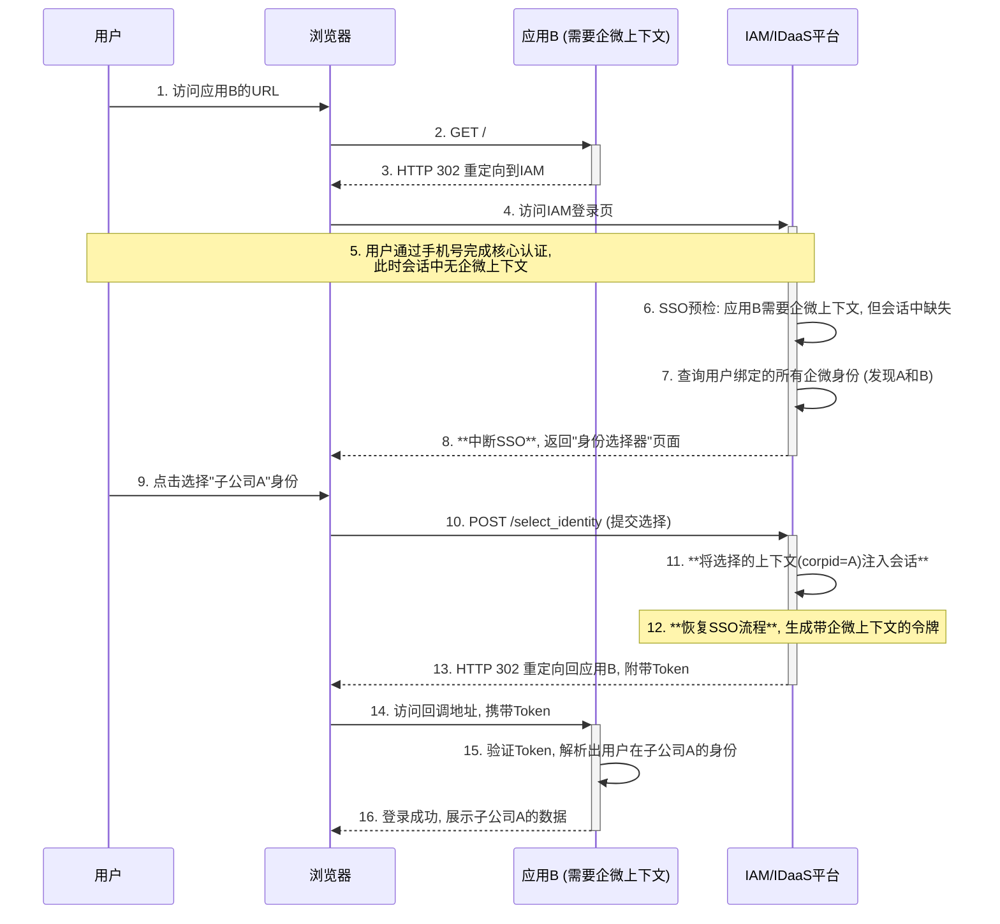

## **第32篇：【解决方案】IAM集成企业微信认证：身份归一与身份隔离**

### **导言**

将应用与企业微信集成时，一个核心的架构决策摆在IAM/IDaaS平台面前：当一个用户通过企业微信认证后，应用系统应该如何看待他的身份？这通常会归结为两种截然不同的业务场景：

1.  **身份归一（Identity Consolidation）：** 应用不关心用户来自哪个具体的子公司或关联企业，只关心这个“自然人”是谁。
2.  **身份隔离（Identity Isolation）：** 应用必须严格区分用户当前的身份上下文，即他此刻是代表哪个子公司或关联企业在进行操作。

为了灵活地支持这两种场景，并应对更复杂的“信息不全”或“身份不明确”的情况，现代IAM平台需要一套先进的身份模型和认证流程。它不再是简单的“主子账户”，而是基于 **“核心身份 + 多方关联”** 的模型，并引入了一个强大的 **“上下文感知与身份选择框架”**。

### **核心身份模型设计：用户与第三方关系**

为了应对复杂场景，IAM平台的用户模型需要包含两个关键实体：

#### **核心用户（Core User）**

*   **定义：** 代表IAM系统中的唯一用户实体。每个用户只有一个核心账户。
*   **属性：** 存储用户的基本信息，如姓名、统一的邮箱、手机号以及IAM自身的唯一用户ID（`user_id`）。这是用户在IAM世界中的“本体”。

#### **第三方身份关联（Third-Party Identity Link）**

*   **定义：** 一个独立的数据实体，用于记录一个核心用户与一个外部身份提供商身份之间的**绑定关系**。
*   **关键设计：** 一个核心用户可以拥有**多个**第三方身份关联记录，**即使这些关联来自同一类型的第三方**（如多个企业微信）。
*   **核心属性：**
    *   `user_id`: 关联到哪个IAM核心用户。
    *   `provider`: 第三方平台类型（如 `wecom`, `dingtalk`）。
    *   **`provider_user_id` (关键字段):** 用户在该第三方平台特定上下文中的唯一标识。对于企业微信，通常采用 **corpid/userid** 的组合字符串格式，以确保全局唯一性。
    *   `metadata`: 一个JSON字段，用于存储从第三方获取的、与该特定身份相关的附加信息（如部门、职位、头像等）。

### **统一认证流程与应用驱动的SSO**

无论最终目标是身份归一还是隔离，初始的认证流程是统一的。区别在于IAM在为不同应用生成SSO令牌时的策略。

#### **第一步：统一的身份识别与上下文建立**

1.  **用户发起认证：** 用户从任一子公司的企业微信工作台点击应用，启动OAuth 2.0授权流程。
2.  **IAM接收回调：** 企业微信将用户重定向到IAM的回调端点，附带`authCode`。
3.  **换取并识别身份：** IAM后端使用`authCode`调用企业微信API，获取到用户的`corpid`和`userid`。
4.  **精确匹配关联关系：** IAM构造出`provider_user_id`（即`corpid/userid`），并在`Third-Party Identity Link`表中进行精确查找。
    *   **首次绑定：** 如果找不到记录，IAM会触发一个“按需绑定”流程，引导用户通过手机验证码等方式确认其核心身份，然后创建新的关联记录。
5.  **建立会话：** 一旦匹配成功，IAM就识别出了用户的**核心身份**（`user_id`）以及他本次登录所使用的**特定企业微信身份上下文**（`provider_user_id`及其`metadata`）。这两部分信息都会被保存在用户的当前会话中。

#### **第二步：应用驱动的令牌生成策略**

在用户会话建立后，IAM在为目标应用生成SSO令牌之前，会检查该应用在IAM中注册的配置需求。

*   **场景A：身份归一（应用不需要企业微信身份）**
    *   **应用配置：** 该应用（如在线学习平台）在IAM中注册时，未要求任何特定的企业微信上下文声明。
    *   **令牌生成逻辑：** IAM在生成令牌时，**忽略**会话中的企业微信身份上下文信息。
        *   令牌基于用户的**核心身份**构建。
        *   `sub` (Subject) 等关键声明指向IAM的核心`user_id`。
        *   不包含任何`corpid`或特定于子公司的部门、职位等信息。
    *   **结果：** 应用接收到一个“干净”的、只代表该自然人的身份令牌。

*   **场景B：身份隔离（应用需要企业微信身份）**
    *   **应用配置：** 该应用（如CRM系统）在IAM中注册时，声明其令牌中**必须包含**一个`wecom_context`的自定义声明。
    *   **令牌生成逻辑：** IAM在生成令牌时，**使用**会话中的企业微信身份上下文信息。
        *   令牌基于用户的**特定关联关系**构建。
        *   除了核心身份信息，**必须**添加一个自定义声明，例如：
            ```json
            "https://iam.mycompany.com/context": {
              "provider": "wecom",
              "corpid": "CORP_A",
              "userid": "zhangsan_A"
            }
            ```
        *   用户的部门、职位等属性，从该关联记录的`metadata`中提取并填充。
    *   **结果：** 应用接收到一个带有明确身份上下文的令牌，并据此进行数据隔离和权限控制。

### **上下文感知与身份选择框架**

当用户从一个**上下文不明确**的入口（如外部浏览器）访问一个**对上下文有特定要求**的应用时，上述流程中的“身份上下文”在初始会话中是缺失的。此时，IAM平台必须能够智能地介入。

这就是 **“上下文感知与身份选择框架”** 的作用。它是一套通用的逻辑，在IAM发起对应用的SSO之前触发。

#### **触发条件**

框架的触发并非总是发生，而是基于**应用侧的需求**和**用户当前会话状态**的动态判断。

#### **工作流程**

1.  **用户访问应用：** 用户通过浏览器访问需要企业微信上下文的应用B。
2.  **IAM核心认证：** 用户通过手机号等方式在IAM完成核心认证，此时会话中只有其核心身份，**没有**企业微信上下文。
3.  **SSO预检（Pre-flight Check）：** 在IAM准备为应用B生成SSO令牌之前，执行预检：
    *   “应用B需要`wecom_context`，但当前用户会话中此信息缺失。”
4.  **触发身份选择：** IAM执行以下逻辑：
    *   查询`Third-Party Identity Link`表，发现该核心用户绑定了**多个**`provider`为`wecom`的身份关联记录（子公司A和B）。
    *   IAM**中断**SSO流程，向用户呈现一个“身份选择器”页面：“您希望以哪个企业微信身份访问应用B？”
        *   “子公司A - 销售经理”
        *   “子公司B - 售后顾问”
5.  **记录选择并完成SSO：**
    *   用户选择“子公司A”。
    *   IAM将这个选择（`provider_user_id: "CORP_A/zhangsan_A"`等）**注入**到当前会话中。
    *   SSO流程恢复，IAM基于这个**刚刚补齐的上下文**，生成一个包含`wecom_context`声明的令牌，发往应用B。

#### **序列图：上下文感知的身份选择流程**



### **总结**

通过采用 **“核心身份 + 多方关联”** 的先进数据模型，并构建一个通用的 **“上下文感知与身份选择框架”**，IAM/IDaaS平台能够以一种极其灵活和可扩展的方式，完美应对企业微信上下游等复杂集成场景。

该方案的核心优势在于：

*   **模型的优雅性：** 用户在IAM中始终是唯一的，避免了主子账户带来的管理复杂性。所有的外部身份都作为一种“关联凭证”存在。
*   **流程的灵活性：** 通过**应用驱动的令牌生成策略**，可以在“身份归一”和“身份隔离”模式之间无缝切换，以满足不同应用的需求。
*   **用户体验的优化：** 支持**按需交互**。只有当应用需要、且当前会话信息不足时，才会触发信息补齐或身份选择，极大地优化了用户体验。

这种设计不仅解决了当前企业微信集成的痛点，更为未来接入更多第三方身份源（如不同的合作伙伴目录、社交平台等）打下了坚实、可扩展的架构基础，是现代IAM平台走向生态化、平台化身份治理的必由之路。

**欢迎关注+点赞+推荐+转发**