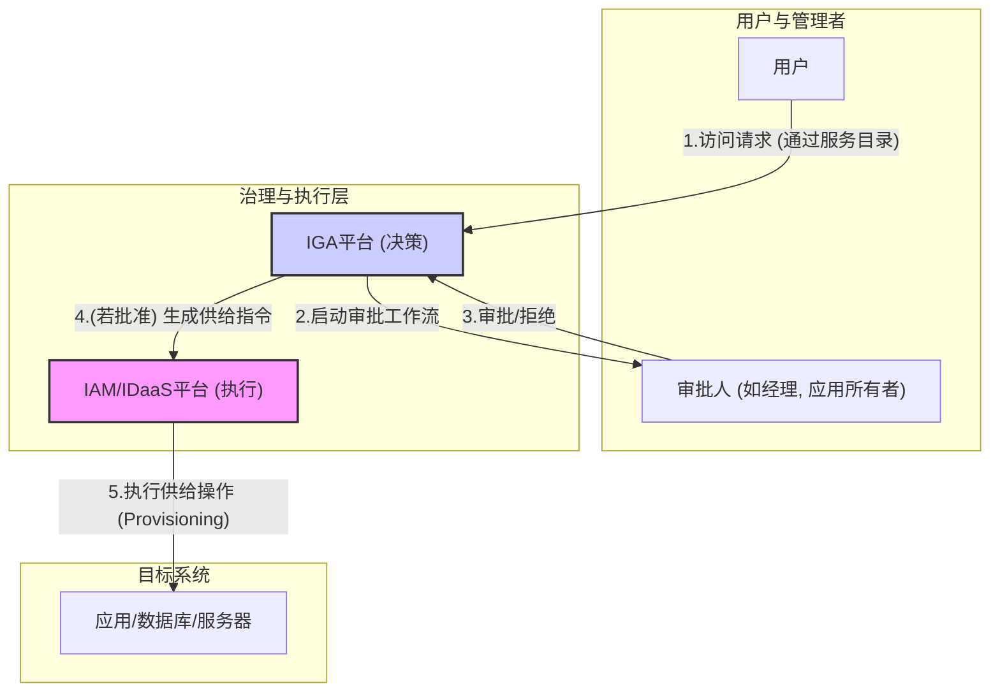

## 第38篇：【架构蓝图】身份治理与管理 (IGA)：确保权限合规与审计就绪

### **导言**

在前面的章节中，我们深入探讨了IAM/IDaaS平台如何执行认证（Authentication）和授权（Authorization）。然而，一个完整的身份管理体系还必须回答一系列更深层次的治理问题：

*   用户**应该**拥有哪些权限？
*   权限的申请和审批流程是否**合规**且**可追溯**？
*   用户已经拥有的权限是否仍然**必要**？
*   如何向审计人员**证明**我们的权限管理是有效的？

解答这些问题的，正是**身份治理与管理（Identity Governance and Administration, IGA）**。如果说核心IAM/IDaaS是执行访问控制的“手脚”，那么IGA就是制定规则、监督执行并进行审计的“大脑”。它将身份管理从一个被动的技术工具，提升为一个主动的、业务驱动的治理框架。

本章将深入探讨IGA的核心流程与架构，重点关注其如何帮助企业**自动化执行最小权限原则**，并轻松**应对合规审计**。

### **核心架构：IGA与IAM的分工与协作**

IGA平台通常作为IAM/IDaaS的上层，或者由IDaaS平台自身提供一个高级的IGA模块。它们之间的关系是**决策与执行**的分离。

*   **IGA平台（决策点 - PDP）：** 负责“谁应该拥有什么权限”的整个生命周期管理，包括请求、审批和审查。
*   **IAM/IDaaS平台（执行点 - PEP）：** 负责接收来自IGA的指令，并在目标系统中实际地创建、修改或删除账户和权限。

#### **IGA核心流程交互图**

### **IGA核心流程之一：访问请求与审批 (Access Request & Approval)**

这是权限“出生”的阶段，IGA确保其过程的规范化和可追溯性。

*   **从混乱到有序：服务目录（Service Catalog）**
    *   **传统方式：** 用户通过邮件、IM或工单系统，模糊地申请“我需要XX系统的权限”。
    *   **IGA方式：** IGA平台提供一个类似“应用商店”的服务目录。用户可以在其中浏览所有可申请的应用、角色或权限包。每个申请项都有清晰的描述和业务理由。

*   **申请即留痕：强制的业务理由（Justification）**
    *   用户在发起请求时，必须填写“为什么需要此权限”的业务理由。这为后续的审批和审计提供了关键的上下文。

*   **智能的审批工作流（Approval Workflow）**
    *   IGA的核心能力之一是其强大的工作流引擎。一个权限的审批不再仅仅是直线经理点击“同意”。
    *   **多级审批：** 可以设计复杂的工作流，例如：
        1.  **第一级：** 用户的直线经理（确认业务需求）。
        2.  **第二级：** 应用所有者（确认权限对应用的风险）。
        3.  **第三级：** 数据所有者（如果涉及敏感数据）。
    *   **动态审批：** 审批人可以根据请求的风险等级、用户属性等动态确定。

### **IGA核心流程之二：认证审查 (Access Certification / Attestation)**

这是权限“体检”和“清理”的阶段，是**自动化执行最小权限原则**的关键机制，旨在解决“权限蠕变”（Privilege Creep）问题。

*   **什么是认证审查？**
    *   定期地、系统性地让相关责任人（如经理、应用所有者）审查其下属或其应用的用户权限，并做出“批准保留”（Approve）或“撤销”（Revoke）的决定。这个过程被称为**证明（Attestation）**。

*   **审查活动的类型（Campaigns）：**
    *   **基于用户的审查：** 经理会收到一份其所有下属员工的权限列表，并逐一确认这些权限是否仍然必要。
    *   **基于应用的审查：** 应用所有者会收到一份拥有其应用访问权限的所有用户的列表，并进行审查。
    *   **基于权限的审查：** 针对某个高风险角色（如“财务管理员”），由指定人员审查拥有该角色的所有用户。

*   **闭环的自动化：**
    *   当审批人在审查活动中点击“撤销”某个权限时，IGA平台会自动生成一个**“取消供给”（De-provisioning）**的指令。
    *   该指令被发送到IAM/IDaaS平台，由其连接器在目标应用中自动移除该用户的权限或禁用账户，形成一个完整的自动化闭环。

### **IGA核心流程之三：生成合规报告以应对审计**

IGA平台的核心价值之一，是它记录了权限生命周期中的**每一个决策和变更**，使其成为一个强大的审计与合规报告中心。

当审计人员提出“谁有权访问财务系统？”或“请证明张三访问CRM的权限是经过合规审批的”这类问题时，IGA平台可以快速生成以下报告：

*   **用户权限报告（User Access Report）：**
    *   **内容：** 某个用户（或所有用户）在所有系统中的完整权限快照。
    *   **回答：** “张三到底拥有哪些权限？”

*   **应用权限报告（Application Access Report）：**
    *   **内容：** 某个应用（或所有应用）的完整权限授权列表。
    *   **回答：** “谁能访问我的CRM系统？”

*   **访问请求与审批历史报告（Request & Approval History）：**
    *   **内容：** 详细记录了每一次权限申请的时间、申请人、申请理由、审批流程中的每一个审批人、审批意见和时间戳。
    *   **回答：** “张三的CRM权限是如何获得的？经过了谁的批准？”

*   **认证审查活动报告（Certification Campaign Report）：**
    *   **内容：** 记录了每一次审查活动的详细情况，包括审查范围、负责人、每一项权限的审查决定（批准/撤销）以及完成时间。
    *   **回答：** “你们是如何定期审查和清理无效权限的？请提供证据。”

*   **职责分离（SoD）冲突报告（Segregation of Duties Violation Report）：**
    *   **内容：** IGA可以预定义冲突的权限组合（如“既能创建供应商，又能批准付款”）。该报告会持续监控并列出所有违反了SoD策略的用户。
    *   **回答：** “你们系统是否存在内部欺诈风险？”

### **总结**

身份治理与管理（IGA）为IAM/IDaaS平台注入了**治理与合规的灵魂**。它通过结构化的**访问请求**、可编排的**审批工作流**以及周期性的**认证审查**，将权限管理从一种被动的、基于请求的IT任务，转变为一种主动的、自动化的、符合最小权限原则的治理流程。

最终，一个强大的IGA能力，使得IAM平台不再仅仅能回答“用户能否访问？”，更能清晰、可信地向管理者和审计人员证明：**“用户的每一次访问，都是被合理申请、被正确批准、并被持续审查的”**。这正是企业在日益严格的合规环境下，构建可信、安全的数字化身份体系所必需的核心能力。

**欢迎关注+点赞+推荐+转发**