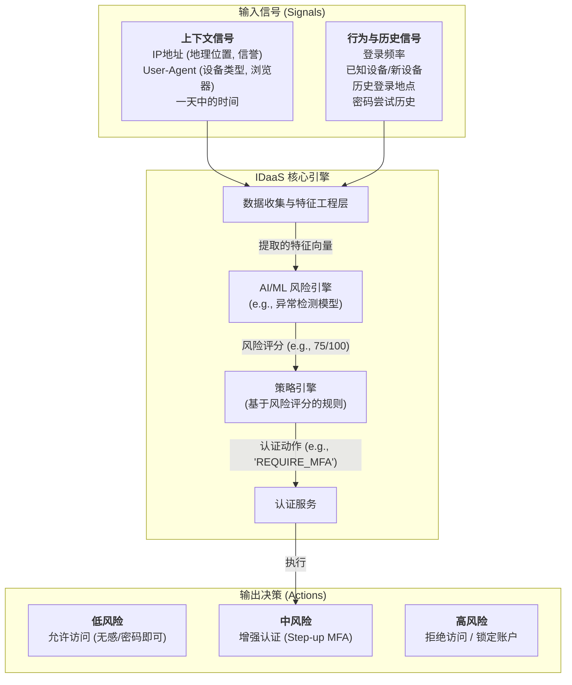
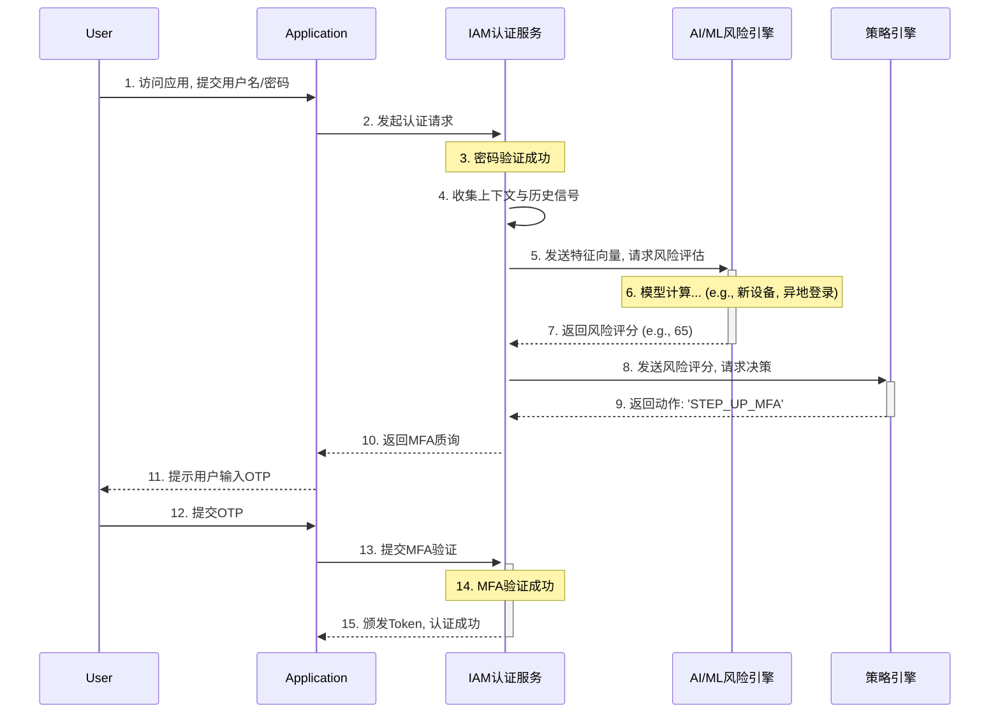

## 第40篇：【AI赋能·访问安全篇】自适应认证：从静态防御到智能守护

### **导言**

传统的MFA（多因素认证）策略，通常是静态的、一刀切的。例如，要求所有用户在每次登录时都必须使用OTP。这种模式虽然提升了安全性，但也带来了不可避免的用户摩擦，严重影响用户体验。

**自适应认证（Adaptive Authentication 或 Adaptive MFA）** 正是为了解决这一矛盾而生。它不再是一个静态的“防御墙”，而是一个智能的“守护者”。其核心思想是：**基于对每次访问请求的实时风险评估，动态地、智能地调整认证强度。**

本章将深入IDaaS平台架构的内部，解构一个由AI/ML驱动的自适应认证系统是如何实现的，重点剖析其三大核心支柱，并探讨其在工程落地中的关键挑战。

### **核心架构：从信号到决策的闭环**

一个完整的自适应认证系统，是一个实时的数据处理与决策闭环。

*   **数据收集层：** 负责从登录请求中提取各种上下文和行为信号。
*   **AI/ML风险引擎：** 接收这些信号，利用机器学习模型，实时计算出一个量化的**风险评分（Risk Score）**。
*   **策略引擎：** 根据管理员预设的策略，将风险评分映射到一个具体的认证动作（Action）。
*   **认证服务：** 最终执行该认证动作。

#### **自适应认证架构图**

### **第一支柱：数据收集与特征工程**

风险引擎无法直接处理原始数据，它需要的是被量化和标准化的**特征（Features）**。

*   **收集的原始信号：**
    *   **上下文信号：** IP地址、User-Agent字符串、地理位置、请求时间戳等。
    *   **行为与历史信号：** 用户的历史登录成功/失败记录、历史使用过的IP和设备、认证频率等。

*   **特征工程（Feature Engineering）：**
    *   这是将原始信号转化为机器学习模型可理解的特征的过程。例如：
        *   `IP地址` -> `is_from_tor_exit_node` (布尔值), `distance_from_last_login_km` (数值)。
        *   `User-Agent` -> `is_new_device` (布尔值), `device_type` (枚举: Mobile/Desktop)。
        *   `登录历史` -> `failed_login_count_last_hour` (数值)。

### **第二支柱：AI/ML风险引擎**

这是自适应认证的智能核心。它的唯一职责，就是接收特征向量，并输出一个**0到100之间的风险评分**。

*   **模型选型：**
    *   **异常检测（Anomaly Detection）：** 最核心的模型。系统会学习每个用户“正常”的行为模式基线。当一个请求显著偏离这个基线时，模型就会给出高风险分。
    *   **监督学习模型（Supervised Learning）：** 如果有足够多的、被标记为“欺诈”或“正常”的历史数据，可以使用如**逻辑回归**或**梯度提升机（GBM）** 等模型，来更精确地预测恶意概率。

### **第三支柱：策略引擎**

策略引擎将风险引擎输出的抽象评分，转化为具体的、可执行的业务规则。

*   **基于阈值的策略配置：**
    *   管理员可以在IDaaS平台中，配置简单而强大的分级策略。例如：
        *   **如果 风险评分 <= 20 (低风险):** 动作: `ALLOW_ACCESS`。
        *   **如果 20 < 风险评分 <= 70 (中风险):** 动作: `STEP_UP_MFA`。
        *   **如果 风险评分 > 70 (高风险):** 动作: `DENY_ACCESS`。

#### **认证流程序列图（中风险场景）**

### **核心工程挑战与解决方案**

#### **1. 如何确认浏览器设备ID？(设备指纹技术)**

对于原生App，获取唯一的设备ID相对容易。但对于浏览器，由于隐私限制，这是一个巨大的挑战。解决方案是采用**设备指纹（Device Fingerprinting）** 技术。

*   **原理：**
    *   IDaaS平台在登录页面加载一个**指纹采集脚本**。
    *   该脚本会收集一系列浏览器和操作系统的**半唯一（Semi-unique）** 特征，例如：User-Agent、屏幕分辨率、安装插件列表、系统字体、Canvas指纹、WebGL指纹等。
    *   将这些特征组合在一起，通过一个稳定的哈希算法，生成一个**高熵的、具有统计学唯一性的设备指纹ID**。
*   **存储与比对：**
    *   当用户首次成功登录后，这个设备指纹ID会与其用户账户**关联并存储**起来。
    *   用户下一次登录时，系统会重新计算当前浏览器的指纹，并与该用户历史记录中的指纹进行比对。如果匹配不上，`is_new_device`这个关键特征就会被标记为`true`。

#### **2. 如何评价特征工程的好坏？(离线评估与在线监控)**

特征工程是“Garbage in, garbage out”的典型领域。评价其好坏需要一个闭环流程。

*   **离线评估（Offline Evaluation）：**
    *   在模型训练阶段，数据科学家会使用历史数据集，通过**特征重要性分析（Feature Importance Analysis）** 来评估每个特征的贡献度。像**SHAP (SHapley Additive exPlanations)** 这样的工具可以清晰地揭示出哪些特征对模型的最终风险判断影响最大。

*   **在线监控（Online Monitoring）：**
    *   模型上线后，必须持续监控关键业务指标。例如，观察 **“高风险拒绝率”** 和 **“中风险MFA成功率”**。如果某个新特征上线后，导致大量正常用户被误判为高风险，则说明这个特征可能引入了噪声，需要被重新评估。

#### **3. 如何安全地灰度发布新版ML模型？(影子模式与A/B测试)**

直接全量上线一个新的、未经充分验证的风险模型是极其危险的。必须采用审慎的灰度发布策略。

*   **阶段一：影子模式（Shadow Mode）**
    *   **原理：** 新版模型（Model B）与当前正在线上服务的旧版模型（Model A）**并行运行**。
    *   **流程：** 只有Model A的评分结果被用于真实的策略决策。Model B的评分结果与Model A的决策会被一起记录到日志中，用于离线分析和比较。
    *   **目的：** 在不影响任何真实用户的情况下，大规模地收集新模型在线上真实流量中的表现数据。

*   **阶段二：A/B测试 (Canary Release)**
    *   **原理：** 在影子模式运行一段时间并确认新模型表现良好后，开始将一小部分**真实流量**切换到新模型上。
    *   **流程：** 例如，将1%的用户流量的决策权交给Model B，并严密监控这1%实验组用户的核心业务指标（如登录成功率、MFA通过率），与对照组进行比较。

*   **阶段三：逐步放量**
    *   如果在小流量测试中，新模型表现符合预期，则可以逐步将流量从1%增加到5%、20%、50%，最终完成100%的全量切换。

### **总结**

AI赋能的自适应认证，是IDaaS平台从一个被动的“门禁系统”向一个主动的“智能安全中枢”演进的关键一步。它深刻地改变了传统的认证模式：

*   **从“一刀切”到“因人而异”：** 基于每个请求的实时风险，提供恰到好处的安全保护。
*   **从“牺牲体验”到“平衡体验”：** 在绝大多数低风险场景下，为用户提供无感、流畅的登录体验，只在必要时才介入，从而极大地降低了用户因MFA疲劳而产生的安全风险。
*   **从“静态防御”到“持续学习”：** 通过AI/ML模型的持续迭代，系统能够不断学习新的攻击模式和正常的用户行为，实现安全能力的自我进化。

最终，一个强大的自适应认证能力，使得IDaaS平台能够真正实现安全与体验的完美平衡，为企业在零信任时代构建起一道既坚不可摧又人性化的智能防线。

**欢迎关注+点赞+推荐+转发**