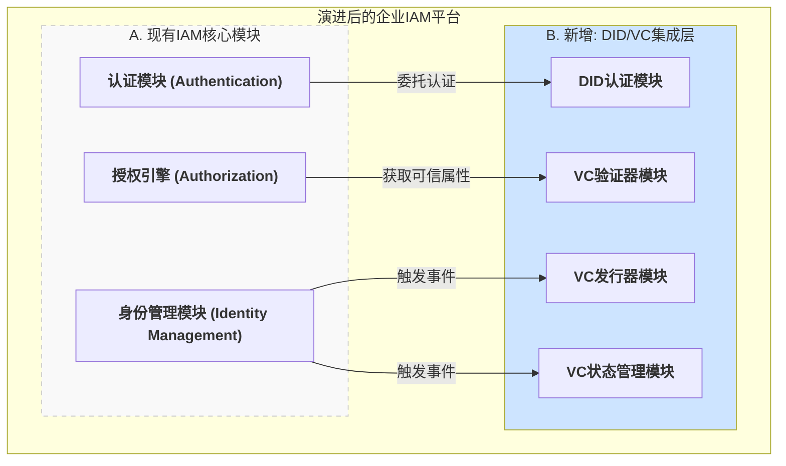
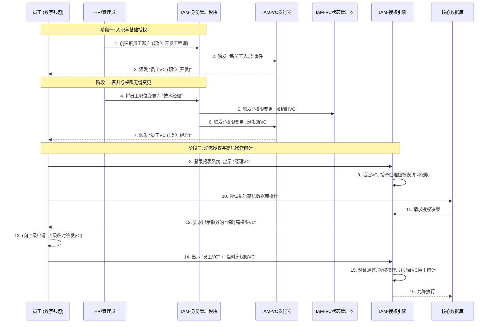
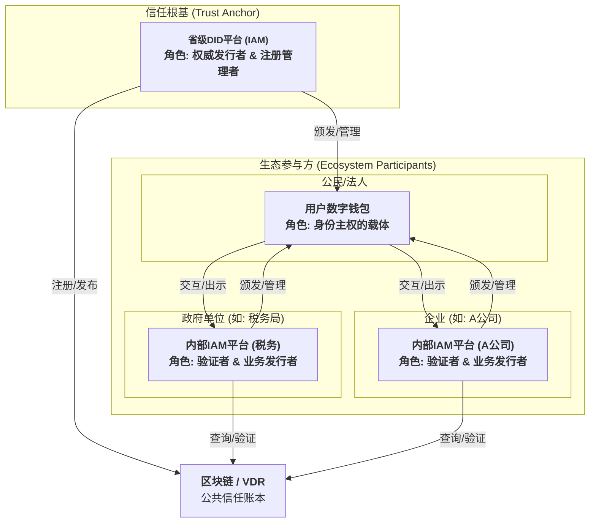
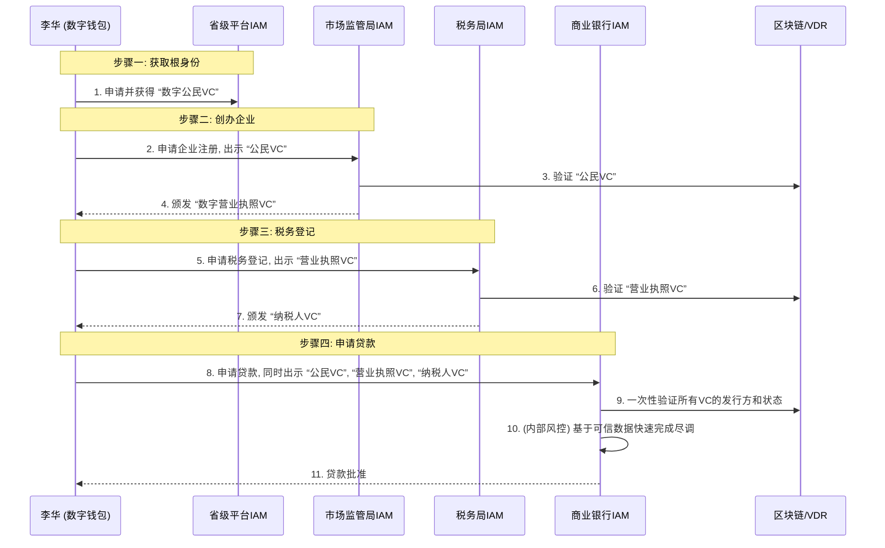

## **第44篇：【未来范式】共生演进：DID如何赋能IAM构建下一代信任生态**

### **导言：身份管理的范式演进**

在数字化浪潮席卷全球的今天，身份与访问管理（IAM）系统已然成为企业安全架构中不可动摇的基石。它们如同中心化的数字身份库，忠诚地守护着企业敏感数据和核心应用的边界。然而，在一个追求万物互联、数据主权和隐私保护的时代，这种“围墙花园”模式正显露出其固有的局限性：用户身份被割裂在无数个孤立的系统中，企业则背负着托管海量敏感数据的沉重责任与风险。

去中心化身份（Decentralized Identity, DID）与可验证凭证（Verifiable Credentials, VC）的出现，并非旨在摧毁现有的IAM体系，而是为其提供了一次深刻的、共生演进的机遇。本文将深入探讨一种务实且强大的策略：**如何在不废弃现有成熟IAM投资的基础上，通过扩展集成DID/VC能力，构建一个更安全、更高效、更以用户为中心的下一代身份生态系统，并展望其在企业乃至社会级大规模场景下的应用。**

### **第一部分：中心化IAM的内在困境**

在深入探讨解决方案之前，我们必须清醒地认识到，变革的驱动力源于现有范式的内在矛盾。

#### **企业的困境：集中化带来的风险与责任**

作为身份数据的全权托管方，企业IAM系统承担了巨大的责任与代价：

*   **安全负债：** 集中化的用户数据库，尤其是密码库，已成为网络攻击的“蜜罐”。每一次大规模数据泄露，都可能给企业带来毁灭性的财务损失和声誉打击。
*   **运营繁琐：** 密码重置、账户解锁等日常操作占据了大量IT资源。在B2B场景中，为合作伙伴、供应商创建和管理账户的流程繁琐且低效，拖慢了业务协作的步伐。
*   **创新壁垒：** 在尝试构建开放生态或提供个性化服务时，企业往往因无法安全、便捷地整合外部身份信息而受限。数据孤岛问题使得跨平台的用户画像构建和信任传递变得异常困难。

#### **用户的困境：身份主权的缺失**

在中心化模型中，用户的数字身份被服务提供商所拥有和控制：

*   **身份主权丧失：** 用户无法真正拥有自己的数字身份。每个服务都要求一次独立的注册，身份数据被重复地复制、存储在用户无法控制的地方。
*   **隐私过度暴露：** 为了获得服务，用户被迫过度分享个人信息，即便业务流程仅需验证其某个特定属性（例如，只需验证“年满18岁”，而非获取完整的出生日期）。
*   **体验碎片化：** 用户需要记忆和管理数十个不同的用户名和密码组合，这种认知负担催生了不安全的行为。

**结论：** 中心化IAM模型已无法完全适应一个强调数据主权、隐私保护和无缝互联的未来。我们需要一种新的信任交互模式。

### **第二部分：企业内循环：IAM的自我进化**

变革可以从内部开始。将DID/VC集成到现有IAM中，首先是一场深刻的**企业内循环**的优化。它并非要颠覆现有系统，而是通过一次“外科手术式”的升级，解决企业在内部安全、权限管理和审计方面最棘手的难题。

#### **架构蓝图：在IAM中植入“去中心化集成层”**

核心原则是**扩展，而非颠覆**。我们将DID视为一种新的认证方法，将VC视为一种新的、可信的内部属性来源。

*   **新增的“DID/VC集成层”** 负责所有与DID/VC相关的专业工作：处理无密码认证、验证VC的真实性与有效性、根据内部数据生成VC，以及管理VC的生命周期（如吊销）。
*   **现有IAM核心模块** 的职责则得到优雅的扩展：
    *   **身份管理模块 (IdM):** 依然是内部身份的权威来源，但其用户生命周期流程现在被赋予了新能力：**触发**VC的发行与吊销。
    *   **认证模块 (Authentication):** 将“DID登录”视为与密码、MFA、SAML并列的一种**新的认证选项**。
    *   **授权引擎 (Authorization):** 其决策依据从单一的内部数据源，扩展为**消费**来自VC验证器的、经过加密验证的内部属性。

#### **动态流程：重塑内部安全与权限管理**

**内部安全与权限变更时序图**

*   **场景详解：**
    1.  **入职与基础授权：** 新员工入职时，IdM系统触发VC发行器为其颁发一枚包含其职位、部门等信息的“员工VC”。
    2.  **晋升与权限无缝变更（关键场景）：** 当员工晋升时，HR只需在IdM中更新其职位。这一操作会自动触发旧VC的吊销和新VC的颁发。下次登录时，授权引擎会读取新VC的属性，自动为其开放经理级的访问权限，彻底解决了传统IAM中权限变更延迟、残留权限等安全风险。
    3.  **动态授权与高危操作审计：** 对于访问核心数据库等高风险操作，授权引擎可以要求员工出示一枚由其上级临时签发的“高权限操作许可VC”。这种“即时授权”模式，使得每一次高危操作都有一个可加密验证、不可否-认的授权凭证（VC）作为审计依据。

### **第三部分：跨域信任的邦联——构建社会级信任生态**

当企业完成了内部的自我进化，将目光投向外部时，一个更宏大的图景徐徐展开。如果说第二部分是为企业内部安装了现代化的身份管理系统，那么第三部分就是将无数个这样的现代化系统连接起来，形成一个繁荣、互信的数字邦联。

#### **从企业内循环到社会大循环**

省级或国家级的DID平台，其本质就是这个数字邦联的**操作系统（Societal OS）**。它不直接管理每个参与方的内部事务，而是提供一套通用的“宪法”（技术标准与治理框架）和基础服务（身份锚定），让所有参与者——政府、企业和公民——都能在一个统一的信任基础上进行高效、安全的互动。

#### **联邦式架构：各司其职的信任生态系统**

**联邦式架构组件图**

*   **架构角色详解：**
    *   **1. 省级DID平台的IAM系统（权威发行者和注册管理者）：**
        作为信任链的绝对根源，其核心职责是 **“锚定现实，确立存在”**。它对接公安、市场监管等权威数据源，为公民和法人颁发最基础的“数字公民身份VC”和“数字营业执照VC”，并负责在区块链上注册自身的发行者DID和管理凭证的吊销状态。

    *   **2. 公司/政府单位内部的IAM平台（业务发行者和访问验证者）：**
        作为生态中的服务提供者，其核心职责是 **“验证身份，授予权限”**。它们信任并验证省级平台颁发的根VC，然后根据自身业务，为用户颁发如“员工VC”、“纳税人VC”等业务凭证，并基于这些凭证进行精细化的访问控制。

    *   **3. 公民/法人的数字钱包（身份主权的载体）：**
        作为用户中心化理念的最终载体，其核心职责是 **“保管身份，保护隐私”**。用户通过钱包安全地存储和管理自己的DID及所有VC，并在与各方交互时，按需、选择性地出示凭证。

#### **动态流程：公民创业贷款“一件事一次办”**

让我们通过一个宏大的跨域场景，来体验这个生态系统的真正威力。公民李华想要创办一家公司并申请启动资金，在传统模式下，这需要他奔波于多个部门，提交大量重复的纸质材料。而在DID生态中，流程将是这样的：

**跨机构协作时序图**

*   **场景详解：**
    1.  **根身份获取：** 李华首先通过省级平台的官方APP，获得由**省级平台IAM**颁发的、证明其合法公民身份的根凭证。这是他在数字世界中所有活动的信任起点。
    2.  **企业创办：** 他在线上向**市场监管局IAM**提交申请，无需上传身份证复印件，只需出示他的“数字公民VC”。市场监管局IAM验证通过后，向他的钱包颁发一枚“数字营业执照VC”。
    3.  **税务登记：** 接着，他向**税务局IAM**申请登记，出示刚刚获得的“营业执照VC”，税务局IAM验证后，向他颁发“纳税人VC”。
    4.  **贷款申请（关键时刻）：** 最后，李华向**商业银行IAM**申请创业贷款。这是一个质变的时刻：他不再需要提交身份证、营业执照、税务登记证等一大堆文件的复印件，只需在钱包中一次性授权，将“公民VC”、“营业执照VC”和“纳税人VC”同时出示给银行。银行的IAM系统作为一个高效的**多源VC验证者**，通过查询区块链，在几秒钟内就确认了所有这些来自不同权威机构的凭证都是真实有效的。基于这些高度可信的数据，银行的风控模型可以快速完成尽职调查，在几分钟内就批准了贷款。

在这个流程中，**信任实现了跨域、无缝的传递和组合**。数据的所有权始终属于李华，而数据的价值则在授权下自由流动，极大地降低了整个社会的信任成本和交易成本。

### **结论：拥抱混合身份的未来**

将DID集成到现有IAM中，不是一场颠覆性的革命，而是一次意义深远的进化。它将传统IAM在精细化权限管控、工作流集成和审计合规方面的深厚积累，与DID在身份自主、密码学安全和跨域互操作性方面的革命性优势完美结合。

我们已经看到，这条演进之路清晰而坚定：

*   **始于内部：** 通过改造企业IAM，解决内部安全与权限管理的痛点，实现降本增效。
*   **成于外部：** 通过构建联邦式的信任框架，打破数据孤岛，赋能数字经济，创新社会治理模式。

从一个封闭的成本中心（管理密码），转变为一个开放的价值中心（赋能信任），这不仅仅是一次技术升级，更是一次深刻的战略转型。未来已来，那些敢于拥抱这种混合身份模式、勇于从“城堡守门人”向“生态赋能者”转型的组织，必将在新一轮的数字化浪潮中，赢得最宝贵的资产——**信任**。

**欢迎关注+点赞+推荐+转发**