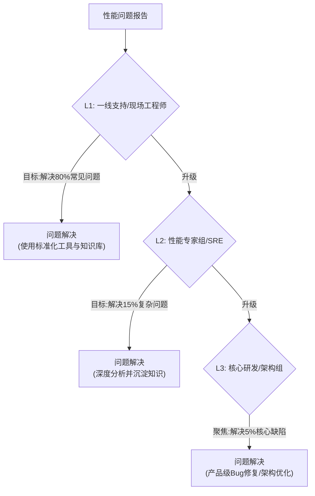

## 告别性能“救火”：一套将部署环境从变量变为常量的方法论

### 一、 诊断：一个普遍存在的“性能困境”

在软件工程领域，我们都熟悉一个令人沮丧的场景：一个在标准环境中表现卓越的产品，部署到客户现场后，性能却屡屡不达标。随之而来的，是无休止的远程会议、日志分析和跨团队的责任推诿。

这并非个例，而是一个普遍存在的行业困境。许多技术团队，无论规模大小，都深陷于一个被动的“性能救火”循环中。其典型症状包括：
*   **核心研发精力被严重消耗：** 本应聚焦于产品创新的架构师和核心开发者，被迫花费大量时间诊断一线环境问题。
*   **交付周期充满不确定性：** 性能问题成为项目上线的最大“拦路虎”，导致交付延迟和客户满意度下降。
*   **知识无法有效沉淀：** 性能优化的宝贵经验，往往以“个人英雄主义”的形式存在，难以被团队复用和传承。

如果我们深入探究，会发现问题的根源并非技术能力不足，而在于一个根本性的认知误区：**我们习惯于将理想环境下的“性能基线”视为一个绝对真理，而将千差万别的客户环境视为一个难以控制的、混乱的“变量”。**

只要我们不改变这个认知，就永远只能在问题的下游疲于奔命。本文旨在提供一个系统性的解决方案框架，其核心思想是：**通过一套科学的方法论，将“环境”这个最大的不确定性变量，转变为一个可量化、可预测、可管理的“常量”。**

### 二、 原则：构建新体系的三大基石

在给出具体的解决方案模式之前，我们必须先确立指导我们行动的三大核心原则。这些原则是构建任何高效性能保障体系的基石。

*   **原则一：量化一切 (Quantify Everything)**
    我们必须用统一的、量化的标尺来度量环境。模糊的描述如“客户的磁盘很慢”是毫无意义的。我们必须能够精确地回答：“这块磁盘的随机写IOPS是多少？与我们的推荐基准相差多少百分比？”。只有量化，才能带来客观的诊断和科学的决策。

*   **原则二：知识下沉 (Shift-Left Knowledge)**
    专家的知识不应被锁在“象牙塔”里。必须通过流程和工具，将资深工程师的诊断逻辑和排查经验，系统化、标准化地赋能给距离客户最近的一线工程师。目标是让80%的常见问题在一线得到解决。

*   **原则三：分层抽象 (Layered Abstraction)**
    我们必须建立一个类似网络协议栈的分层模型来处理问题。每一层都应有清晰的职责边界，只处理自己能力范围内的问题，并将更复杂的问题向上层传递。这能避免所有压力都汇集到核心研发这一个单点上。

### 三、 模式：三位一体的卓越性能保障框架

基于上述三大原则，我们提出一个由 **“一个核心模型”、“一套分层流程”和“一个赋能工具集”** 构成的三位一体解决方案框架。

#### 模式一：从“静态基线”到“动态性能函数”的核心模型

这是整个框架的认知核心，它直接体现了 **“量化一切”** 的原则。我们必须废除“一刀切”的性能基线，代之以一个更科学的动态模型：

**预期性能 = f(环境指数)**

要实现这个模型，你需要做两件事：
1.  **定义“环境指数 (Environment Index)”：** 创建一个标准化的评分卡，对一个部署环境的关键基础设施（CPU、内存、磁盘I/O、网络等）进行基准测试，并根据其对你产品性能的影响权重，给出一个综合的量化分数。
2.  **建立性能函数关系：** 通过在不同“环境指数”的服务器上进行测试，你可以逐步建立起性能表现与环境指数之间的函数关系。例如，在一个指数为80分的环境中，达到理想基线的90%即为优秀；而在120分的环境中，则可以预期超越基线的性能。

这个模型最大的价值在于，它为性能讨论提供了一个客观、公正的对话基础。

#### 模式二：“性能支持分层模型 (Tiered Performance Support Model)”

这个流程模式是 **“分层抽象”** 和 **“知识下沉”** 原则的具体体现。它将性能问题的处理流程划分为三个明确的层级：

*   **L1 - 一线支持 (First Line Support):** 这是“守门人”层。他们的职责是运行标准化的诊断工具、收集数据，并对照知识库解决绝大多数常见的配置和环境问题。
*   **L2 - 性能专家组 (Performance CoE/SRE):** 这是“攻坚与赋能”层。他们负责处理一线无法解决的复杂问题，更重要的职责是将分析过程和解决方案，转化为新的知识库条目和自动化脚本，反哺L1。
*   **L3 - 核心研发 (Core R&D):** 这是“最终保障”层。他们只处理由L2确认的、与产品核心代码或架构相关的缺陷。这保证了他们的精力始终聚焦在最高价值的创造性工作上。

#### 模式三：“环境基准评估套件 (Environment Baselining Kit)”

这是支撑整个框架运转的“赋能工具集”，是 **“知识下沉”** 原则的最终载体。任何团队都可以基于开源工具，构建一个这样的轻量级套件。

你可以从以下几个方面着手设计你的工具套件：
*   **核心引擎：** 采用fio, sysbench, iperf3等行业标准工具，确保测试结果的权威性和可比性。
*   **一键封装：** 将所有工具和测试脚本封装在一个包里，通过一个主启动脚本 (check_env.sh或 run_benchmark.py) 来调度执行，实现“一键体检”。
*   **配置化基线：** 将你的性能基准值和“环境指数”的评分权重，全部定义在外部配置文件中，使其易于维护和调整。
*   **可解释的报告：** 输出一份对非专家友好的HTML或Markdown报告，清晰地展示环境总分、各项指标的得分、潜在瓶颈以及自动化的优化建议。

这个工具套件，本质上是将L2、L3专家的诊断经验，代码化、自动化，并赋予给L1的工程师。

### 四、 如何开始：将框架付诸实践

将这个框架应用到你的组织中，可以从以下几个小步骤开始：

1.  **进行一次“性能问题复盘会”：** 统计一下过去一个季度，核心研发团队有多少工时被投入到了一线性能支持中？最常见的性能瓶颈是什么？用数据来暴露痛点。
2.  **开发一个MVP版本的“环境评估脚本”：** 不用追求完美，先用一个简单的Shell脚本，把对磁盘IOPS和网络延迟这两个最常见瓶颈的测试自动化起来。
3.  **选择一个试点项目：** 在下一个新项目中，尝试使用这个MVP脚本进行前置环境评估，并与客户基于数据设定一个合理的性能预期。
4.  **建立一个共享知识库：** 从记录第一个通过脚本发现并解决的问题开始，逐步沉淀你的性能优化知识。

### 结语：从救火员到架构师的转变

我们所面临的性能困境，本质上是一个系统性问题，它无法通过零敲碎打的努力或增加人力来解决。我们必须从认知上升级，在流程上重塑，在工具上赋能。

本文提出的“三位一体”框架，并非一个僵化的教条，而是一套可以被任何技术团队采纳和改造的思维模式和实践指南。它的最终目标，是帮助我们所有人完成一次关键的身份转变——**从被动响应的“救火员”，转变为主动规划、用数据驱动决策的“性能架构师”**。这条路，将引领我们构建更可靠的软件，赢得客户的信任，并最终解放我们去创造更大的价值。