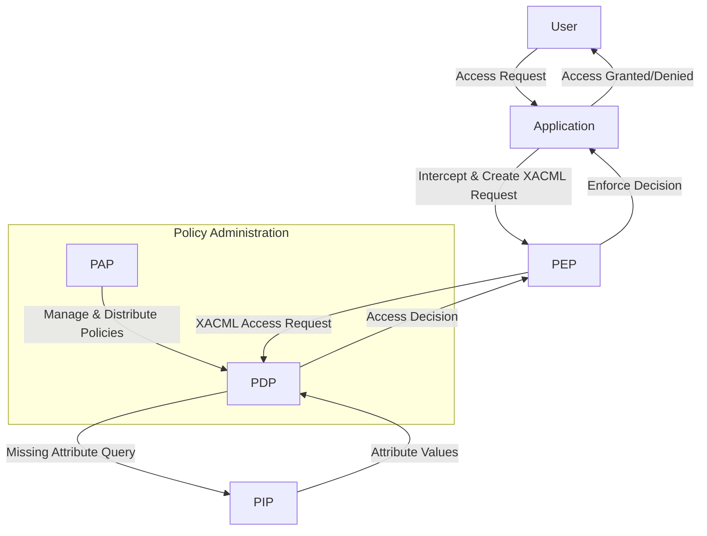

+++
mermaid = true
+++
## 第12篇：策略即代码：初探基于策略的访问控制（PBAC）与XACML

在之前的文章中，我们讨论了RBAC（基于角色的访问控制）和ABAC（基于属性的访问控制）。RBAC通过预定义的角色简化了权限管理，而ABAC则通过评估运行时属性实现更精细和动态的授权。本篇，我们将进一步探讨一种将授权逻辑推向“策略即代码”境界的模型——**基于策略的访问控制（Policy-Based Access Control，简称PBAC）**，以及实现PBAC的行业标准**XACML**。

PBAC的核心思想是将所有的授权规则表达为结构化的、可机器解析的策略，并由专门的引擎进行评估和执行。这使得授权逻辑可以像代码一样被管理、版本控制和自动化。

### 1\. 策略即代码：PBAC的核心思想

**基于策略的访问控制（PBAC）** 是一种授权范式，它将授权决策从应用程序的业务逻辑中解耦出来，通过定义一套明确的、可执行的**策略（Policies）** 来驱动访问决策。

PBAC的理念可以概括为“策略即代码”：

  * **策略是核心：** 所有的授权规则都表现为具体的策略，这些策略清晰地定义了在什么条件下，谁可以对什么资源执行什么操作。
  * **可外部化：** 授权逻辑不再硬编码在应用内部，而是以独立的策略文件或服务形式存在。这意味着你可以不修改应用程序代码就改变授权逻辑。
  * **可自动化：** 策略可以用机器可读的语言编写，方便自动化工具进行管理、部署、测试和审计。
  * **可审计性：** 策略的清晰定义使得授权决策的依据一目了然，极大地提升了审计和合规性。

PBAC与ABAC的关系非常紧密。事实上，PBAC是ABAC的一种高级实现形式，它提供了将ABAC中基于属性的规则（如“如果主体部门是资源部门，且操作是读取，则允许”）以结构化、标准化的策略语言表达和执行的框架。可以说，**ABAC是决策模型，而PBAC是实现这个模型的具体方法论和技术体系。**

### 2\. XACML：PBAC的工业级标准

为了标准化PBAC的实现，**OASIS（结构化信息标准促进组织）** 制定了**XACML（eXtensible Access Control Markup Language，可扩展访问控制标记语言）** 标准。XACML是一个声明式语言，用于表达访问控制策略，并定义了一个体系结构，规范了授权决策的各个组件及其交互方式。

XACML提供了一种强大且灵活的方式来编写复杂、细粒度的访问控制策略。它允许策略包含以下逻辑：

  * **目标（Target）：** 策略适用的主体、资源和操作的初始匹配条件。
  * **规则（Rule）：** 具体执行“允许”或“拒绝”决策的条件逻辑。
  * **效应（Effect）：** 如果规则满足，是“允许”（Permit）还是“拒绝”（Deny）。
  * **条件（Condition）：** 结合属性和函数进行更复杂的逻辑判断。
  * **规则组合算法（Rule Combining Algorithm）：** 当多个规则适用时，如何得出最终决策（例如，是“先拒绝”原则还是“先允许”原则）。
  * **策略集（Policy Set）：** 多个策略的集合，也可以有自己的策略组合算法。

### 3\. XACML的核心架构组件

XACML定义了一个明确的授权体系结构，包含以下四个主要组件，它们协同工作来完成访问控制决策：

#### 3.1 策略执行点（Policy Enforcement Point, PEP）

  * **作用：** PEP是离应用程序最近的组件，负责拦截用户对资源的访问请求。它就像一个“门卫”，在用户尝试进入时进行检查。
  * **职责：**
    1.  **拦截请求：** 当应用程序收到用户对受保护资源的请求时，PEP会拦截这个请求。
    2.  **生成访问请求：** PEP将访问请求转换为XACML格式的**访问请求上下文（Access Request Context）**，其中包含了请求中所有相关的**主体属性、资源属性、环境属性和操作属性**。
    3.  **发送到PDP：** PEP将这个XACML格式的访问请求发送给策略决策点（PDP）。
    4.  **执行决策：** 接收PDP返回的访问决策（Permit/Deny/NotApplicable/Indeterminate），并据此强制执行（允许或拒绝访问）。

#### 3.2 策略决策点（Policy Decision Point, PDP）

  * **作用：** PDP是XACML架构的核心，它负责接收PEP的访问请求，并根据预定义的XACML策略集做出授权决策。它就像一个“中央决策大脑”。
  * **职责：**
    1.  **接收请求：** 从PEP接收XACML访问请求上下文。
    2.  **获取策略：** 加载并识别所有相关的XACML策略和策略集。
    3.  **获取属性：** 如果请求上下文中缺少做出决策所需的某些属性，PDP会请求策略信息点（PIP）来获取这些属性。
    4.  **评估策略：** 根据XACML策略的规则和条件，评估所有属性，并根据策略组合算法得出最终的授权决策。
    5.  **返回决策：** 将最终决策（如Permit、Deny）返回给PEP。

#### 3.3 策略信息点（Policy Information Point, PIP）

  * **作用：** PIP是属性数据的来源。当PDP在评估策略时发现缺少某些必要的属性信息（如用户的最新部门信息、资源的当前状态等），它会向PIP发出请求。PIP就像一个“数据源连接器”。
  * **职责：**
    1.  **集成外部数据源：** 连接到各种外部数据源，如LDAP目录、数据库、HR系统、微服务API、CRM系统等。
    2.  **按需提供属性：** 根据PDP的请求，从这些数据源中检索并提供所需的属性值，将其返回给PDP。

#### 3.4 策略管理点（Policy Administration Point, PAP）

  * **作用：** PAP是负责创建、存储、管理、部署和维护XACML策略的组件。它就像一个“策略管理员”。
  * **职责：**
    1.  **策略创作：** 提供界面或API，允许管理员编写和修改XACML策略。
    2.  **策略存储：** 安全地存储策略，通常在一个策略存储库中。
    3.  **策略分发：** 将策略部署和分发给PDP。
    4.  **策略版本控制：** 管理策略的版本，支持回滚和审计。
    5.  **策略测试与调试：** 提供工具测试策略的有效性和预期行为。

**XACML架构组件交互图示：**

### 4\. PBAC/XACML的优势与适用场景

**优势：**

  * **高度灵活性和动态性：** 能够处理极其复杂和动态的授权规则，远超RBAC和简单ABAC的表达能力。
  * **解耦性：** 将授权逻辑从应用代码中完全分离，实现业务逻辑和安全逻辑的独立演进。
  * **细粒度控制：** 可以实现对数据字段、API参数甚至时间、地理位置等上下文的超细粒度授权。
  * **集中化管理：** 所有策略集中管理，便于审计、一致性部署和变更控制。
  * **可审计性和透明度：** 策略的声明性使得决策过程可理解、可追溯。
  * **跨平台/语言：** XACML作为XML标准，可以跨越不同的编程语言和技术栈实现互操作性。

**适用场景：**

  * **高合规性要求行业：** 金融、医疗、政府等需要严格满足数据隔离、职责分离等复杂合规性要求的场景。
  * **大数据和微服务架构：** 数据量巨大且访问模式复杂，需要基于数据属性、服务调用者属性进行动态授权。
  * **多租户SaaS平台：** 租户之间数据严格隔离，且不同租户有不同定制化授权需求的场景。
  * **API安全网关：** 在API层面进行精细的认证和授权控制。
  * **零信任架构：** 作为零信任策略引擎的核心组成部分，实现基于上下文的动态授权。

**挑战：**

  * **学习曲线陡峭：** XACML的语法和概念相对复杂，学习和掌握需要一定时间。
  * **初始部署和集成复杂：** 搭建XACML体系架构（PDP、PIP等）可能需要专业知识和工具。
  * **性能考量：** 复杂的策略评估可能会引入额外的延迟，需要进行性能优化。

### 总结

基于策略的访问控制（PBAC）代表了授权管理的未来方向，它将授权逻辑抽象为可管理、可执行的策略，实现了“策略即代码”的理念。XACML作为PBAC的工业级标准，提供了一个完善的架构（PEP、PDP、PIP、PAP）和强大的策略语言，能够处理最复杂、最动态的授权场景。

虽然PBAC和XACML的学习和实施成本相对较高，但它们带来的灵活性、精细度、可审计性和解耦性，使其成为构建高度安全、适应性强的现代IAM系统的理想选择，尤其是在需要应对复杂业务规则和严格合规性要求的企业级场景中。

###
**欢迎关注+点赞+推荐+转发**