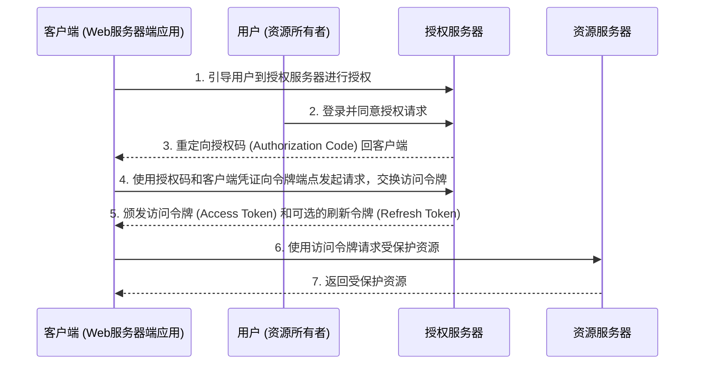

+++
mermaid: true
+++
## 第13篇：OAuth 2.0（上）：授权框架的核心流程与角色

在当今的数字生态系统中，我们经常遇到这样的场景：一个应用（例如，一个照片编辑工具）需要访问你在另一个服务（例如，Google相册）上的资源。你当然不希望把Google相册的用户名和密码直接告诉照片编辑工具，因为这不仅不安全，也意味着这个工具将拥有你账户的全部权限。

正是为了解决这种“委托授权”的问题，**OAuth 2.0**应运而生。它不是一个认证协议，而是一个授权框架，允许第三方应用**在不获取用户凭证的情况下，安全地访问用户在服务提供者处的受保护资源。**

### 1. OAuth 2.0的背景与目标

#### 1.1 背景：为什么需要OAuth？

在OAuth出现之前，应用程序访问用户资源的常见方式是 **“共享凭证模式”**：用户直接把自己在A网站的用户名和密码提供给B网站，让B网站以用户身份登录A网站并获取数据。这种模式存在巨大弊端：

* **安全风险高：** B网站获取了用户的真实凭证，可以对A网站进行任何操作，包括未经授权的操作。如果B网站发生数据泄露，用户的A网站凭证也将暴露。
* **无法细粒度授权：** 无法控制B网站只能访问特定资源或执行特定操作。
* **凭证生命周期管理困难：** 用户无法方便地撤销B网站的访问权限，除非修改A网站密码，这会影响其他所有依赖该密码的应用。

OAuth 1.0在一定程度上解决了这些问题，但其复杂性限制了广泛应用。**OAuth 2.0**则在1.0的基础上进行了彻底的简化和改进，使其更易于实现和部署，成为现代API授权的事实标准。

#### 1.2 目标：委托授权与安全解耦

OAuth 2.0的核心目标是实现**委托授权（Delegated Authorization）**，即允许用户授权第三方应用（客户端）在限定的权限（作用域/Scope）内，代表用户访问其在资源服务器上的特定资源。

它旨在实现：
* **安全性：** 用户凭证不直接暴露给第三方应用。
* **授权范围控制：** 用户可以明确授权第三方应用访问哪些资源，以及进行哪些操作（通过Scope）。
* **便捷性：** 用户授权过程简化，用户体验提升。
* **可撤销性：** 用户可以随时撤销对第三方应用的授权，而无需修改密码。

### 2. OAuth 2.0的核心角色

OAuth 2.0框架中定义了四个核心角色，理解它们之间的交互是理解OAuth 2.0流程的关键：

#### 2.1 资源所有者（Resource Owner）

* **定义：** 拥有受保护资源的个人或实体。通常是最终用户。
* **作用：** 授权客户端应用访问其在资源服务器上的资源。

#### 2.2 客户端（Client）

* **定义：** 希望访问受保护资源的应用程序。可以是Web应用、移动应用、桌面应用或服务器端应用。
* **作用：** 代表资源所有者向资源服务器请求访问受保护资源。客户端必须预先在授权服务器注册，获得client_id和client_secret。

#### 2.3 授权服务器（Authorization Server）

* **定义：** 负责验证资源所有者身份，并在资源所有者同意后，向客户端颁发访问令牌（Access Token）。
* **作用：** 是OAuth 2.0流程的枢纽。它处理用户的认证和授权，管理客户端的注册，并颁发不同类型的令牌。

#### 2.4 资源服务器（Resource Server）

* **定义：** 存储并提供受保护资源的服务器。
* **作用：** 接收客户端的资源请求，通过验证请求中携带的访问令牌的有效性来决定是否允许访问资源。

### 3. OAuth 2.0的四种主要授权模式（Grant Types）

OAuth 2.0定义了多种授权模式（Grant Types），以适应不同类型的客户端和应用场景。每种模式都有其特定的工作流程和安全考量。

#### 3.1 授权码模式（Authorization Code Grant）

* **特点：** 这是最常用、最安全、也是推荐用于**Web服务器端应用**的授权模式。
* **流程概述：**
    1.  **客户端请求授权：** 客户端引导用户到授权服务器进行授权。
    2.  **资源所有者授权：** 用户在授权服务器上登录并同意授权请求。
    3.  **授权服务器颁发授权码：** 授权服务器将一个**授权码（Authorization Code）** 重定向回客户端（通过客户端预注册的重定向URI）。
    4.  **客户端使用授权码换取令牌：** 客户端（服务器端）使用授权码和其client_secret（客户端凭证）向授权服务器的令牌端点（Token Endpoint）发起请求，交换访问令牌。
    5.  **授权服务器颁发令牌：** 授权服务器验证授权码和客户端凭证，然后颁发**访问令牌（Access Token）**和可选的**刷新令牌（Refresh Token）**。
    6.  **客户端使用令牌访问资源：** 客户端使用访问令牌向资源服务器请求受保护资源。
* **安全性：** 授权码通过浏览器传递，但访问令牌的交换发生在客户端服务器和授权服务器之间（后端通信），客户端凭证得以保密，避免泄露。刷新令牌可用于获取新的访问令牌，延长会话而无需用户重新授权。
* **适用场景：** 传统的Web服务器端应用（如Java Spring Boot应用、Node.js应用）。

#### 3.2 隐式模式（Implicit Grant）

* **特点：** 专为**单页应用（SPA）**和**原生移动应用**设计，其特点是直接在浏览器端或移动应用中获取访问令牌。
* **流程概述：**
    1.  **客户端请求授权：** 客户端引导用户到授权服务器进行授权。
    2.  **资源所有者授权：** 用户在授权服务器上登录并同意授权请求。
    3.  **授权服务器直接颁发令牌：** 授权服务器将**访问令牌**直接作为URI片段（#access_token=...）重定向回客户端。
    4.  **客户端使用令牌访问资源：** 客户端从URI中解析出访问令牌，并使用它访问资源服务器。
* **安全性：** 令牌直接在浏览器URI中暴露，没有刷新令牌，安全性较低。在公共客户端（Public Clients，如SPA）中，客户端凭证无法安全存储。**在OAuth 2.1中已被弃用，推荐使用带PKCE（Proof Key for Code Exchange）的授权码模式替代。**
* **适用场景：** 早期用于SPA和移动应用，但现在**不推荐使用**。

#### 3.3 客户端凭证模式（Client Credentials Grant）

* **特点：** 这种模式不涉及资源所有者（用户）的参与，而是用于客户端（通常是服务器端应用或服务）直接以自身身份向资源服务器请求访问。
* **流程概述：**
    1.  **客户端请求令牌：** 客户端使用其client_id和client_secret直接向授权服务器的令牌端点请求访问令牌。
    2.  **授权服务器颁发令牌：** 授权服务器验证客户端凭证，然后颁发**访问令牌**。
    3.  **客户端使用令牌访问资源：** 客户端使用访问令牌向资源服务器请求受保护资源。
* **安全性：** 客户端凭证必须得到严密保护，仅适用于高度受信任的服务器端客户端。
* **适用场景：** 服务间调用（Service-to-Service Communication），例如一个微服务需要访问另一个微服务的API。

#### 3.4 密码模式（Resource Owner Password Credentials Grant）

* **特点：** 客户端直接要求资源所有者提供其用户名和密码，然后客户端将这些凭证发送给授权服务器以获取访问令牌。
* **流程概述：**
    1.  **客户端收集凭证：** 客户端向用户请求用户名和密码。
    2.  **客户端发送凭证换取令牌：** 客户端将用户名、密码和其client_id和client_secret（可选）发送给授权服务器的令牌端点。
    3.  **授权服务器颁发令牌：** 授权服务器验证用户凭证和客户端凭证，然后颁发**访问令牌**和可选的**刷新令牌**。
    4.  **客户端使用令牌访问资源：** 客户端使用访问令牌访问资源服务器。
* **安全性：** **这是最不安全的模式。** 用户的真实密码直接暴露给客户端。这违背了OAuth 2.0不共享凭证的核心目标。
* **适用场景：** 仅在客户端高度可信（例如，授权服务器自身的第一方应用）且其他模式不可用时作为**最后的选择**。**通常不推荐使用。**

### 总结

OAuth 2.0是一个强大而灵活的授权框架，它通过将授权过程中的各个角色职责分离，并引入访问令牌的概念，实现了安全、可控的委托授权。理解其背景、核心角色以及四种主要授权模式（授权码、隐式、客户端凭证、密码）是掌握其精髓的第一步。

通过这些授权模式，客户端能够安全地获取代表用户访问资源的凭证，而无需直接处理用户敏感的登录凭证。然而，OAuth 2.0的强大远不止于此，其核心还在于它所颁发的**令牌（Token）**，以及令牌背后所承载的**授权范围（Scope）**。这些要素共同构成了OAuth 2.0体系的安全基石，并需要结合一系列**安全最佳实践**才能发挥最大效用。

在下一篇中，我们将深入探讨OAuth 2.0中的**令牌机制、作用域的概念**，并分享一些**重要的安全最佳实践**，以帮助您更全面地理解和应用这一授权框架。

###
**欢迎关注+点赞+推荐+转发**