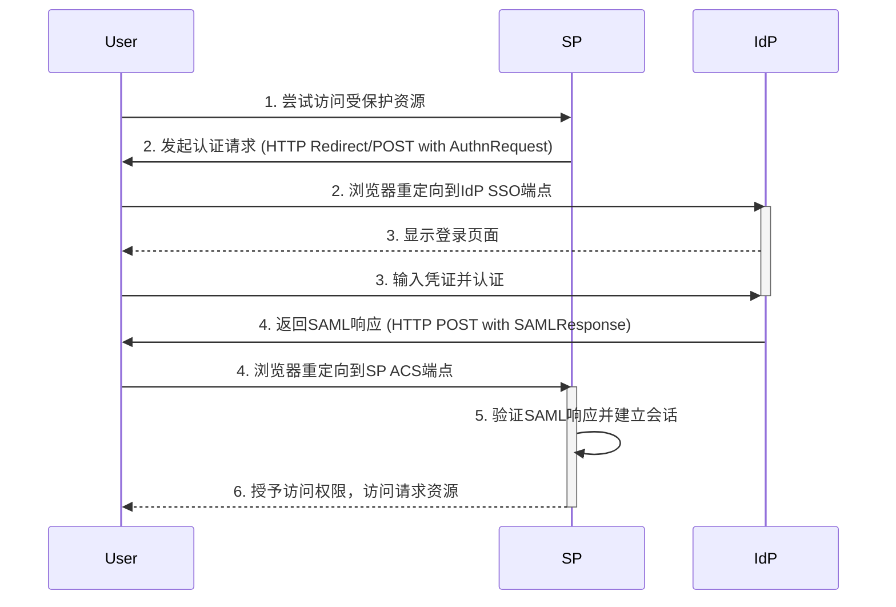
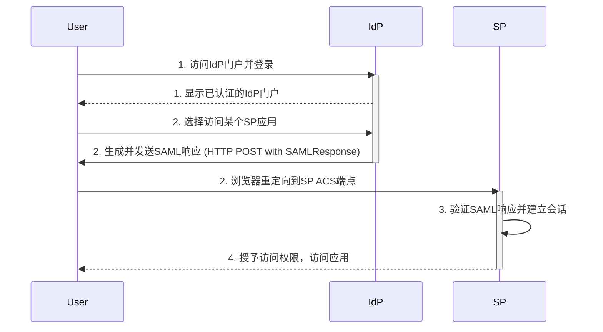

+++
draft: true
mermaid: true
+++

## 第16篇：企业级SSO的利器SAML 2.0协议详解

在上一篇文章中，我们深入探讨了OpenID Connect (OIDC) 如何在OAuth 2.0之上构建身份认证层，成为现代互联网和移动应用SSO的主流选择。然而，在企业级应用和组织间协作的场景中，尤其是一些传统或遗留系统，你可能更常听到另一个强大的SSO协议——**SAML 2.0 (Security Assertion Markup Language)**。

SAML 2.0是基于XML的开放标准，专门用于在不同安全域之间安全地交换认证和授权数据。它在企业级SSO领域扮演着举足轻重的角色，是许多大型企业内部应用以及企业与云服务（如Salesforce、Microsoft 365等）进行身份联邦的基石。

### 1. SAML 2.0的核心概念：信任的桥梁

SAML 2.0的核心在于构建一个**信任联盟（Trust Federation）**，允许用户在一个信任域（通常是企业内部）完成认证后，无需重复登录即可访问另一个信任域（例如，一个外部SaaS应用）的资源。理解其核心概念是掌握SAML的关键。

#### 1.1 身份提供者（Identity Provider, IdP）

* **定义：** IdP是负责**认证用户身份**并**生成SAML断言**的实体。它就像一个“数字护照签发机构”。
* **职责：**
    * 接收用户的认证请求（例如，登录页面的用户名密码）。
    * 验证用户凭证。
    * 成功认证后，生成一个包含用户身份和属性信息的SAML断言（Assertion），并对其进行数字签名。
    * 将SAML断言发送给服务提供者（SP）。
* **常见示例：** 企业内部的Active Directory Federation Services (AD FS)、Okta、PingFederate、Azure AD等。

#### 1.2 服务提供者（Service Provider, SP）

* **定义：** SP是提供具体应用服务并依赖IdP进行用户认证的实体。它就像一个“边境检查站”，接收并验证数字护照。
* **职责：**
    * 接收用户的访问请求。
    * 检测用户是否已认证。如果未认证，将用户重定向到IdP。
    * 接收来自IdP的SAML断言。
    * 验证SAML断言的有效性（包括签名、时间戳、受众等）。
    * 根据断言中的用户身份信息，创建本地会话并允许用户访问应用。
* **常见示例：** Salesforce、Microsoft 365、Workday、各种企业内部Web应用。

#### 1.3 SAML 断言（SAML Assertion）

* **定义：** SAML断言是SAML协议的核心，它是一个XML文档，包含了由IdP生成的关于用户身份和认证事件的声明（Statements）。它就像一份数字化的“身份证明”或“通行证”。
* **核心信息：**
    * **认证声明（Authentication Statement）：** 声明了用户何时、何地以及如何被IdP认证。
    * **属性声明（Attribute Statement）：** 包含了用户的各种属性信息（Attributes），如姓名、邮箱、部门、角色等。这些属性可以用于SP进行授权决策或填充用户档案。
    * **授权决策声明（Authorization Decision Statement）：** 较少使用，可用于声明IdP对特定资源或操作的授权决策。
* **安全性：** SAML断言必须由IdP进行**数字签名**，以确保其完整性和真实性，防止篡改。SP会使用IdP的公共证书来验证此签名。断言通常也会被加密传输。

### 2. SAML 2.0的两种主要工作流程

SAML 2.0主要定义了两种用户启动SSO的流程，它们决定了用户在未登录时首先访问哪一方。

#### 2.1 SP-Initiated SSO（服务提供者发起）

这是最常见的SAML SSO流程，用户通常从尝试访问某个SP的应用开始。

1.  **用户尝试访问SP资源：** 用户通过浏览器访问SP上的一个受保护资源。
2.  **SP发起认证请求：** SP发现用户未登录，生成一个SAML认证请求（`AuthnRequest`，XML格式），并将其编码后（通常是Base64编码）通过HTTP重定向（GET）或HTTP POST（表单提交）方式，将用户浏览器重定向到IdP的SSO端点，请求用户认证。
    * **HTTP Redirect Binding：** `AuthnRequest`被压缩、Base64编码后放入URL参数。适用于较小的请求。
    * **HTTP POST Binding：** `AuthnRequest`被Base64编码后放入一个HTML表单的隐藏字段，表单自动提交到IdP。
3.  **用户在IdP认证：** 用户浏览器被重定向到IdP的登录页面。用户在此处输入凭证（用户名/密码，可能还有MFA）进行认证。
4.  **IdP生成并返回SAML响应：** IdP验证用户凭证成功后，生成一个包含认证信息和用户属性的SAML响应（`Response`，XML格式，内含SAML断言），并对其进行数字签名。然后，IdP将这个SAML响应编码后（通常是Base64编码）通过HTTP POST（自动提交的HTML表单）方式，将用户浏览器重定向回SP的Assertion Consumer Service (ACS) 端点。
5.  **SP验证SAML响应并建立会话：** SP的ACS端点接收SAML响应，验证其数字签名、断言的有效性（如时间戳、受众等），并从断言中提取用户身份和属性信息。
6.  **SP授予访问权限：** SP根据验证通过的SAML断言为用户创建本地会话，并允许用户访问请求的资源。

#### 2.2 IdP-Initiated SSO（身份提供者发起）

这种流程相对简单，用户通常从IdP的门户网站登录开始。

1.  **用户在IdP门户登录：** 用户直接访问IdP的门户（例如，企业内部员工门户）并在此处登录。
2.  **IdP生成并发送SAML响应：** IdP认证用户成功后，用户可以选择访问某个已集成的SP应用。IdP会立即生成一个包含用户身份和属性信息的SAML响应（`Response`，XML格式，内含SAML断言），并对其进行数字签名。然后，IdP将这个SAML响应编码后（通常是Base64编码）通过HTTP POST方式，将用户浏览器重定向到指定SP的ACS端点。
3.  **SP验证SAML响应并建立会话：** SP的ACS端点接收SAML响应，验证其有效性并提取用户信息。
4.  **SP授予访问权限：** SP根据验证通过的SAML断言为用户创建本地会话，并允许用户访问应用。

* **对比：** SP-Initiated SSO更常见，因为它允许用户从任何一个SP应用启动登录，用户体验更自然。IdP-Initiated SSO则适合从企业内部统一门户访问所有应用的场景。

### 3. SAML 2.0的绑定（Bindings）：传输SAML消息的方式

SAML 2.0定义了多种“绑定”（Bindings），它们描述了SAML消息（如`AuthnRequest`和`Response`）如何在不同的传输协议（如HTTP）上进行交换。最常用的两种是：

#### 3.1 HTTP Redirect Binding

* **原理：** SAML消息（如`AuthnRequest`）会被压缩并进行Base64编码，然后作为URL查询参数附加到HTTP重定向（GET请求）中。
* **特点：**
    * 简单，广泛支持。
    * URL长度有限制，不适合传输大的SAML消息。
    * 消息内容暴露在URL中（尽管编码了，但并非加密），不适合传输敏感信息。
* **适用场景：** 通常用于SP向IdP发送`AuthnRequest`，因为请求通常较小。

#### 3.2 HTTP POST Binding

* **原理：** SAML消息会被Base64编码，然后作为隐藏的表单字段（`SAMLRequest`或`SAMLResponse`）放置在一个HTML表单中，并通过HTTP POST方法自动提交到目标URL。
* **特点：**
    * 没有URL长度限制，可以传输更大的SAML消息。
    * 消息内容不会直接暴露在URL中。
    * 是SAML响应（`Response`）最常用的传输方式，因为它包含敏感的认证断言。
* **适用场景：** IdP向SP发送`SAMLResponse`，以及一些SP发送`AuthnRequest`的场景。

**除了上述两种，还有SOAP Binding（通过SOAP协议传输）等，但HTTP POST和HTTP Redirect是最普遍使用的。** 所有的SAML通信都应该在**HTTPS/TLS**加密通道上进行，以保护传输中的敏感数据。

### 总结

SAML 2.0作为一个成熟且广泛采纳的企业级SSO协议，通过定义IdP、SP和SAML断言等核心概念，以及SP-Initiated和IdP-Initiated两种主要工作流程，实现了不同安全域之间的身份联邦。其基于XML和数字签名的特性，使其在安全性和互操作性方面表现出色，成为连接企业内部系统与外部云服务的强大工具。

尽管其配置和实现可能比OIDC更为复杂，但SAML 2.0在传统企业和大型组织架构中仍然扮演着不可替代的角色。理解SAML 2.0的工作原理和最佳实践，是构建复杂IAM和身份联邦解决方案的关键能力。

###
**欢迎关注+点赞+推荐+转发**