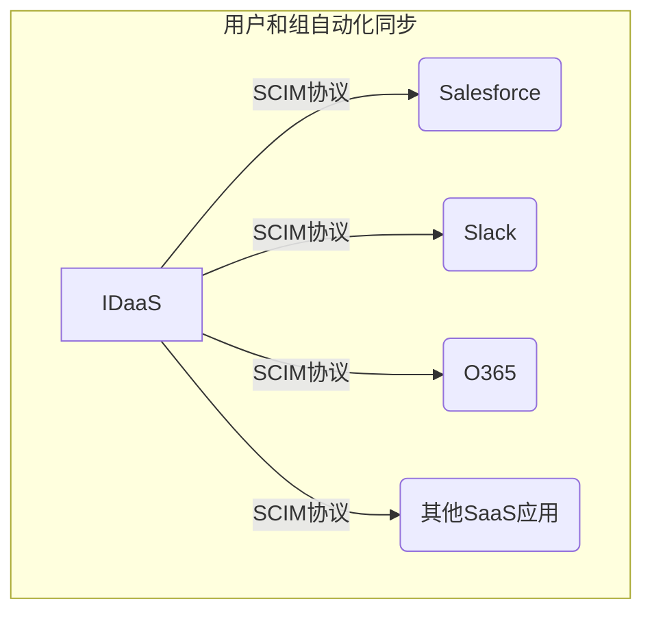

+++
draft: true
mermaid: true
+++

## 第17篇：自动化身份供给：SCIM协议如何简化用户管理

在之前的文章中，我们讨论了身份认证（Authentication）和授权管理（Authorization）的各种核心协议与模型。然而，一个完整的身份和访问管理（IAM）体系，不仅仅包括“谁能登录”和“谁能做什么”，还必须高效地解决“用户身份信息如何创建、更新和同步到各个应用”的问题。这正是**身份供给（Identity Provisioning）** 的职责所在。

想象一下，当一个新员工入职时，他需要访问公司的CRM、ERP、协作套件（如Office 365）等多个系统。如果每次都需要IT管理员手动在每个系统中创建账户、分配权限，这无疑是一项繁琐、耗时且容易出错的工作。当员工离职或部门调动时，手动管理带来的效率低下和安全风险（权限未及时撤销）将更加凸显。

**SCIM（System for Cross-domain Identity Management）协议**正是为了解决这一痛点而诞生的。它提供了一种标准化的方式，实现用户和组身份信息的自动化管理和跨域同步。

### 1. SCIM的目标：简化与标准化身份供给

SCIM是由IETF（互联网工程任务组）发布的一个开放标准，旨在简化和自动化用户和组身份信息在不同系统之间的交换。其核心目标可以概括为：

* **互操作性：** 提供一个通用的、基于RESTful API的协议和JSON数据模型，使得任何支持SCIM的系统都能“开箱即用”地进行身份信息交换，避免了定制化开发带来的高成本和复杂性。
* **自动化：** 实现用户生命周期管理（创建、更新、禁用、删除）的自动化，减少人工干预。
* **效率：** 显著提升身份供给的效率，加速新员工入职、离职等流程。
* **安全性：** 确保身份信息的准确性和及时性，降低因手动操作导致的权限配置错误和安全漏洞。
* **扩展性：** 允许扩展核心的用户和组模式（Schema），以适应各种特定业务需求。

在现代的**IDaaS（Identity as a Service）** 解决方案中，SCIM扮演着至关重要的角色。IDaaS平台通常作为中央身份源，通过SCIM与下游的各种SaaS应用（如Salesforce, Slack, Google Workspace, Microsoft 365等）进行用户和组信息的自动化同步。

### 2. SCIM的核心资源：用户与组

SCIM协议定义了两个核心的资源类型，用于表示和管理身份信息：

#### 2.1 用户（User）资源

* **定义：** 代表了系统中的一个独立用户身份。
* **核心属性：** SCIM User Schema定义了一套丰富的标准属性，包括：
    * `userName`：用户的唯一登录名（必填）。
    * `id`：资源的唯一标识符。
    * `displayName`：用户的显示名称。
    * `name`：包含`givenName`（名）、`familyName`（姓）等子属性。
    * `emails`：用户的邮箱地址（可以是多个，带类型如`work`, `home`）。
    * `active`：布尔值，表示用户是否活跃/启用（用于禁用/启用用户）。
    * `password`：密码（敏感信息，通常只用于设置/重置，不用于读取）。
    * `groups`：用户所属的组列表（引用）。
* **扩展性：** SCIM允许服务提供者通过自定义的**扩展模式（Extension Schema）** 来添加标准模式中没有的额外属性，以满足特定应用的业务需求，例如自定义的员工ID、组织架构信息等。

#### 2.2 组（Group）资源

* **定义：** 代表了一组用户的集合。组在权限管理中非常有用，可以方便地对一组用户统一分配权限。
* **核心属性：** SCIM Group Schema定义了：
    * `displayName`：组的显示名称。
    * `members`：组的成员列表，每个成员包含`value`（用户ID）和`displayName`（用户显示名）等。

SCIM通过这些标准化的资源和属性，确保了不同系统之间身份数据的一致性和可理解性。

### 3. SCIM的核心操作：CRUD与批量处理

SCIM协议基于RESTful原则，定义了一系列标准的HTTP方法来对用户和组资源进行操作，类似于我们熟悉的CRUD（创建、读取、更新、删除）。

#### 3.1 创建（Create）

* **方法：** `POST`
* **用途：** 在目标系统中创建一个新的用户或组。
* **示例：** 向 `/Users` 或 `/Groups` 端点发送一个包含用户/组JSON数据的POST请求。

#### 3.2 读取（Retrieve）

* **方法：** `GET`
* **用途：** 获取一个特定用户/组的详细信息，或查询满足特定条件的用户/组列表。
* **示例：**
    * 获取单个用户：`GET /Users/{id}`
    * 按用户名查询：`GET /Users?filter=userName eq "john.doe"`
    * 分页查询：`GET /Users?startIndex=1&count=10`
* **特性：** SCIM支持丰富的过滤（`filter`）、排序（`sortBy`, `sortOrder`）和分页（`startIndex`, `count`）参数，以及指定返回属性（`attributes`, `excludedAttributes`），使得查询非常灵活高效。

#### 3.3 更新（Update）

* **方法：** `PUT` 或 `PATCH`
* **用途：** 修改现有用户或组的信息。
    * **`PUT`：** 用于完全替换资源的现有状态（不常用，因为需要提交所有属性）。
    * **`PATCH`：** 用于部分更新资源。这是更推荐的方式，因为它允许只发送需要修改的属性，例如更改用户的部门、禁用用户、添加/移除组成员等。
* **示例：**
    * 更新用户：`PATCH /Users/{id}`，请求体中包含JSON Patch操作。
    * 禁用用户：`PATCH /Users/{id}`，请求体 `{ "active": false }`。

#### 3.4 删除（Delete）

* **方法：** `DELETE`
* **用途：** 从目标系统中删除一个用户或组。
* **示例：** `DELETE /Users/{id}`

#### 3.5 批量操作（Bulk Operations）

* **方法：** `POST` 到 `/Bulk` 端点
* **用途：** 允许在一个HTTP请求中执行多个SCIM操作（创建、更新、删除），从而减少网络往返次数，提高同步效率。这对于同步大量用户或组时非常有用。
* **示例：** 向 `/Bulk` 发送一个POST请求，请求体中包含一个操作数组，每个操作指定其方法、资源路径和数据。

### 4. SCIM在IDaaS中的应用

SCIM协议是现代**IDaaS（Identity as a Service）** 解决方案的核心能力之一。一个典型的应用场景是：

1.  **中央身份源：** 企业通常有一个中央身份目录（如Active Directory, LDAP）或是一个IDaaS平台本身作为主身份源。
2.  **IDaaS作为供给桥梁：** IDaaS平台集成SCIM客户端功能，可以作为连接中央身份源和各种下游应用之间的桥梁。
3.  **自动化同步：**
    * 当新员工入职时，在中央身份源中创建其账户。IDaaS平台通过连接器（如AD Connector）感知到这一变化。
    * IDaaS平台随即触发SCIM协议，向所有支持SCIM的SaaS应用（例如Salesforce、Slack）发送`POST /Users`请求，自动为新员工创建账户。
    * 当员工部门调动，其组发生变化时，IDaaS通过SCIM向相关应用发送`PATCH /Users/{id}`请求更新其组信息。
    * 当员工离职时，IDaaS向各应用发送`PATCH /Users/{id}`（设置`active: false`禁用账户）或`DELETE /Users/{id}`请求，及时撤销其访问权限。
4.  **实时与定时同步：** SCIM支持实时（事件驱动）或定时（批量）同步，以满足不同的业务需求。

### 总结

SCIM协议是自动化身份供给的关键。它提供了一个标准化的、基于RESTful的框架，用于管理和同步用户与组的身份信息。通过定义统一的资源模式和操作方法，SCIM极大地降低了集成成本，提升了身份管理效率，并增强了安全性。在IDaaS解决方案中，SCIM更是扮演着核心角色，使得企业能够轻松实现跨域的用户生命周期自动化管理，告别繁琐的手动配置，让身份管理真正做到“一劳永逸”。

###
**欢迎关注+点赞+推荐+转发**