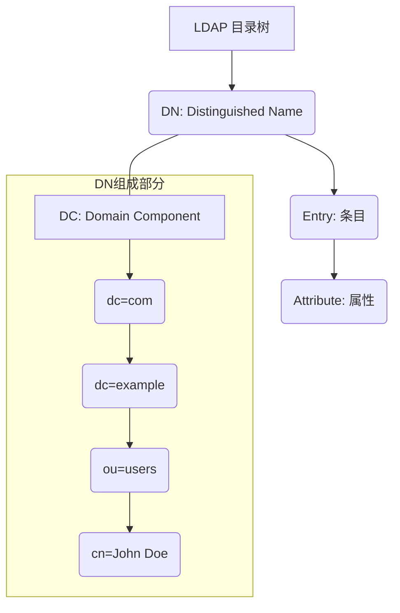

## 第18篇：老牌目录服务：LDAP协议基础与应用场景

在之前我们探讨的身份与访问管理（IAM）体系中，无论是用户认证、授权决策，还是身份供给，其核心都离不开对**用户身份信息**的存储和管理。这些信息需要被高效地查询、更新，并能够被各种应用服务共享。而承担这一重任的，正是**目录服务**。

在众多目录服务技术中，**LDAP（Lightweight Directory Access Protocol，轻量级目录访问协议）** 无疑是最古老、最成熟且应用最为广泛的标准之一。它在企业级IAM领域占据着举足轻重的地位，是许多传统系统和现代解决方案的基石。

### 1. 什么是LDAP？

LDAP是一种用于访问和维护分布式目录信息服务的应用层协议。简单来说，它就像一个专门存储和查询“白页”（例如，电话簿、员工花名册）的数据库，但它比传统数据库更专注于读取操作的效率，并针对层次化、树状结构的数据存储进行了优化。

LDAP目录服务通常用于存储：

  * **用户账户信息：** 用户名、密码哈希、电子邮件、电话号码、部门、职位等。
  * **组信息：** 组名称、成员列表。
  * **网络资源信息：** 打印机、服务器、共享文件等。
  * **应用程序配置信息：** 集中存储应用的配置参数。

### 2. LDAP的核心概念：构建目录的基石

LDAP目录中的数据以**树状层级结构**组织，类似于文件系统的目录结构。理解以下几个核心概念，是理解LDAP的关键：

#### 2.1 目录项（Entry）

  * **定义：** 目录项是LDAP目录中存储的每一个独立的信息单元，类似于数据库中的一行记录或文件系统中的一个文件。每个目录项都代表一个真实世界的对象（如用户、组、设备等）。
  * **特性：** 每个目录项都有一个唯一的标识符，称为**判别名（Distinguished Name, DN）**。

#### 2.2 属性（Attribute）

  * **定义：** 每个目录项由一系列**属性**组成，每个属性由一个**类型（Type）**和一个或多个**值（Value）**构成。属性描述了目录项的特征。
  * **示例：**
      * `cn` (Common Name)：通用名，如`John Doe`。
      * `sn` (Surname)：姓，如`Doe`。
      * `givenName`：名，如`John`。
      * `mail`：电子邮件地址。
      * `uid` (User ID)：用户ID。
      * `objectClass`：必选属性，定义了目录项的类型和必须包含的属性集合。
  * **Schema（模式）：** LDAP目录遵循一定的**Schema**。Schema定义了目录中可以存储哪些`objectClass`，每个`objectClass`可以包含哪些属性，以及属性的语法（例如，字符串、整数、二进制）。

#### 2.3 判别名（Distinguished Name, DN）

  * **定义：** DN是LDAP目录中**唯一标识一个目录项的字符串**。它明确了该目录项在目录树中的完整路径。DN由一系列**相对判别名（Relative Distinguished Name, RDN）** 组成，从最特定的（通常是目录项本身）到最不特定的（根目录）。
  * **结构：** RDN之间用逗号（`,`）分隔，顺序从左到右是从下往上（叶子到根）。
  * **示例：**
      * `cn=John Doe,ou=users,dc=example,dc=com`
          * `cn=John Doe` 是该目录项的RDN（Common Name为John Doe）。
          * `ou=users` 是其父目录的RDN（组织单元为users）。
          * `dc=example,dc=com` 是根域的RDN。
  * **唯一性：** DN在整个LDAP目录中必须是唯一的。

#### 2.4 相对判别名（Relative Distinguished Name, RDN）

  * **定义：** RDN是DN中最左边（最具体）的部分，它唯一标识了在特定父目录项下的子目录项。
  * **示例：** 在 `cn=John Doe,ou=users,dc=example,dc=com` 中，`cn=John Doe` 就是该目录项的RDN。

### 3. LDAP的常用操作

LDAP协议定义了一系列用于访问和修改目录数据的标准操作：

#### 3.1 绑定（Bind）/ 认证

  * **用途：** 客户端向LDAP服务器进行认证，以建立会话并获取访问权限。
  * **方式：** 通常使用DN和密码进行认证，也可以使用匿名绑定或SASL（Simple Authentication and Security Layer）等更高级的认证机制。
  * **安全性：** LDAP协议本身默认传输是明文，强烈建议通过**LDAPS（LDAP over SSL/TLS）** 进行加密通信，以保护传输中的凭证和数据。

#### 3.2 搜索（Search）

  * **用途：** 这是LDAP最常用的操作。客户端可以根据各种条件查询目录中的目录项。
  * **参数：**
      * **Base DN：** 搜索的起始目录点（搜索范围的根）。
      * **Scope：** 搜索范围。
          * `base`：只搜索Base DN本身。
          * `one`：搜索Base DN下一层的所有子目录项（不包括Base DN本身）。
          * `sub`：搜索Base DN及其所有子目录项。
      * **Filter：** 定义搜索条件的过滤表达式（例如，`(objectClass=user)`、`(&(objectClass=user)(mail=*@example.com))`）。
      * **Attributes：** 指定返回哪些属性。
  * **示例：** 查找`ou=users,dc=example,dc=com`下所有`objectClass`为`user`且`cn`为`John Doe`的目录项，并返回`mail`和`telephoneNumber`属性。

#### 3.3 添加（Add）

  * **用途：** 在目录中添加一个新的目录项。
  * **要求：** 需要指定新目录项的DN和所有必需的属性。

#### 3.4 修改（Modify）

  * **用途：** 修改现有目录项的一个或多个属性值。
  * **方式：** 可以增加、删除或替换属性值。

#### 3.5 删除（Delete）

  * **用途：** 从目录中删除一个目录项。删除一个目录项会同时删除其所有子目录项。

#### 3.6 比较（Compare）

  * **用途：** 比较目录项的某个属性值是否与指定值匹配。

#### 3.7 重命名/移动（Modify DN）

  * **用途：** 更改目录项的DN，可以将其重命名或移动到目录树中的另一个位置。

### 4. LDAP在传统IAM中的地位与应用场景

LDAP协议及其目录服务在传统企业IAM架构中扮演着核心角色，主要体现在以下方面：

#### 4.1 统一身份存储（Centralized Identity Store）

  * **基石：** LDAP目录作为企业内部**唯一的、权威的身份源**，集中存储所有员工、部门、组的身份信息。这避免了多系统多套身份数据带来的不一致和管理混乱。
  * **数据共享：** 其他应用系统可以通过LDAP协议方便地查询和集成这些身份数据。

#### 4.2 认证服务（Authentication Service）

  * **集中认证：** 许多企业应用（如Web应用、VPN、网络设备）都配置为通过LDAP协议向中央LDAP服务器进行用户认证。用户只需在LDAP中拥有一个账户，就可以登录所有关联系统。
  * **SSO基础：** 虽然LDAP本身不直接提供SSO功能，但它是许多传统SSO解决方案（如Kerberos、以及一些基于代理的SSO）的底层认证数据源。用户在成功通过LDAP认证后，可以在其他应用中获得免密访问。

#### 4.3 授权管理的基础（Authorization Basis）

  * **角色/组存储：** LDAP目录可以用来存储用户的组信息（例如，用户属于“销售部”、“管理员”等组）。这些组信息可以作为应用进行RBAC（基于角色的访问控制）决策的依据。应用查询用户的组属性，然后根据这些组来赋予相应的权限。

#### 4.4 应用程序目录

  * 除了用户和组，LDAP还可以存储应用程序自身的配置数据，实现配置的集中管理。

#### 4.5 与AD的紧密联系

  * **Active Directory（活动目录）** 是微软推出的一种目录服务，它在底层基于LDAP协议。因此，掌握LDAP对于理解和管理Active Directory至关重要。许多针对AD的身份认证和查询操作，实际上就是通过LDAP协议实现的。

**挑战：**
尽管LDAP非常强大和稳定，但它在处理大规模动态变化的数据、支持现代Web/移动应用以及与云服务集成方面，相比RESTful API和JSON数据模型可能显得不那么灵活和现代化。这也是SCIM等协议兴起的原因之一。

### 总结

LDAP协议是目录服务领域的“老牌劲旅”，以其高效的读取性能和层次化的数据组织方式，在企业级IAM中扮演着不可或缺的角色。它作为统一的身份存储、认证和授权基础，支撑着大量传统企业的IT基础设施。理解LDAP的目录项、属性、DN等核心概念，以及其搜索、绑定等操作，是深入理解企业IAM底层架构的关键。

虽然新兴协议如SCIM和OAuth/OIDC在某些现代场景下更具优势，但LDAP在企业内部和传统系统中的地位依然不可动摇，并且与Active Directory等主流目录服务紧密相连。

###
**欢迎关注+点赞+推荐+转发**