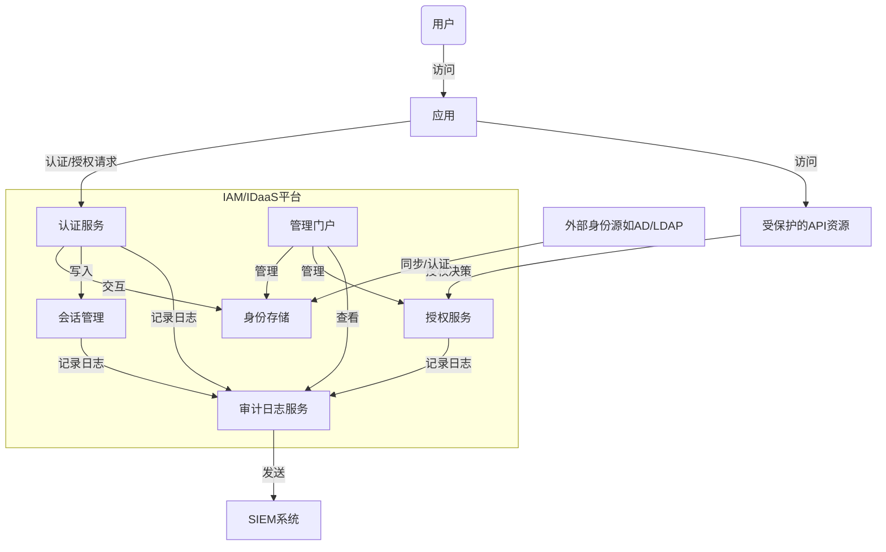
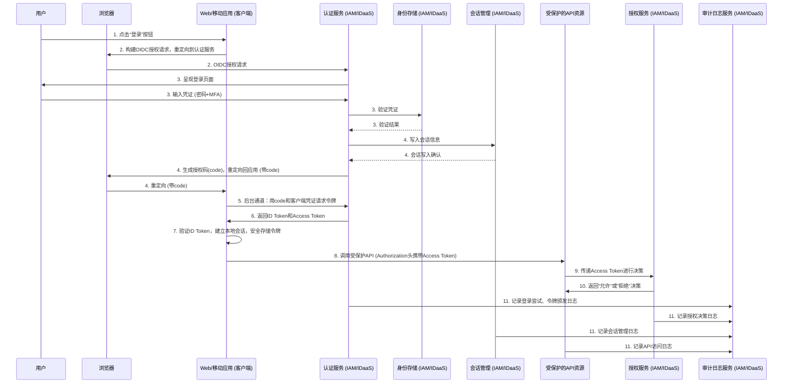

+++
mermaid = true
+++
## 第19篇：【架构篇】设计一个IAM系统：核心模块剖析

在前面的模块中，我们已经深入探讨了身份认证（Authentication）与授权（Authorization）的各种模型，并精解了支撑现代IAM体系的核心协议，如OAuth 2.0、OIDC、SAML及SCIM。我们已经掌握了构建身份信任的“积木块”。现在，我们将把这些独立的知识点串联起来，进入**模块五：IAM/IDaaS系统架构设计**。本篇将从系统架构的视角，审视如何将这些协议与模型组装成一个功能完备、安全且可扩展的IAM系统。

设计一个IAM系统远非简单地实现几个协议，它是一项复杂的系统工程，需要对多个核心模块进行深思熟虑的设计，并确保它们之间的高效协作。这不仅是技术的挑战，更是在安全性、用户体验、开发成本和运维复杂度之间进行艰难权衡的艺术。

### IAM系统核心模块概览与动态交互

一个典型的IAM系统，其内部模块并非孤立存在，而是通过定义清晰的API和数据流，形成一个有机的整体。在深入每个模块之前，让我们先通过一个典型的**单点登录（SSO）与API访问流程**来理解它们的动态协作。




### 1. 身份存储 (Identity Store)：权威的真理之源 (The Authoritative Source of Truth)

身份存储是IAM的心脏，但它的设计远非“选择一个数据库”那么简单。它的核心挑战在于如何定义和维护关于“身份”的唯一、权威的真实来源，并平衡一致性、性能和集成成本。

#### 决策框架：没有银弹，只有场景驱动的选择

| 场景 | 核心挑战 | 推荐架构 | 关键考量与权衡 |
| :--- | :--- | :--- | :--- |
| **场景1：传统大型企业**<br/>(已有成熟AD/LDAP体系) | **集成与兼容性** | **联邦/同步模式**，以AD/LDAP为权威源。 | **决策点：** 联邦 (Federation) vs. 同步 (Synchronization)。<br/>- **联邦 (SAML/OIDC):** IAM作为代理，将认证请求实时转发给ADFS/LDAP。**优点：** 无需存储密码，实时性好。**缺点：** 强依赖于AD/LDAP的可用性。<br/>- **同步 (SCIM/LDAP Sync):** IAM定期从AD/LDAP拉取身份数据。**优点：** IAM可独立提供服务，性能更好。**缺点：** 存在数据延迟，需处理同步冲突和一致性问题。**工具选型：** 考虑单向同步（AD->IAM）以简化管理，避免双向同步的复杂循环更新问题。 |
| **场景2：亿级C端互联网应用** | **海量用户与高并发** | **分布式NoSQL数据库** (如 DynamoDB, Cassandra) | **决策点：** 如何处理最终一致性。<br/>- **写后读一致性：** 对于密码修改、手机号绑定等关键操作，必须在应用层或数据库层面保证强一致性读，避免用户修改后立即读取到旧数据。<br/>- **数据分区策略：** 基于`UserID`或`TenantID`进行分区，避免热点问题。数据模型设计需反范式化，以优化读性能。 |
| **场景3：多租户SaaS平台** | **租户数据强隔离** | **关系型数据库 (如PostgreSQL)** 结合特定隔离模式 | **决策点：** 隔离模型的选择。<br/>- **行级安全 (Row-Level Security, RLS):** 在数据库层面实现租户隔离，应用代码相对简洁。**优点：** 优雅，单数据库易于管理。**缺点：** RLS策略复杂时可能影响性能，跨租户分析困难。<br/>- **Schema-per-Tenant:** 每个租户一个独立的Schema。**优点：** 强隔离，易于备份/恢复单个租户。**缺点：** 租户数量巨大时，数据库连接和管理变得复杂，Schema变更困难。 |

#### 真实世界场景与反模式

*   **场景化问题：** “在一个复杂的B2B SaaS平台中，一个用户可能同时属于多个组织（租户），并在每个组织中拥有不同的角色和属性。如何设计数据模型？”
    *   **解决方案：** 避免将租户信息直接耦合在核心用户表（`Users`）中。采用**桥接表**（如`Memberships`或`TenantUsers`）来关联用户、租户和角色。`Users`表存储全局唯一的用户信息（如登录凭证、姓名），而`Memberships`表存储特定于租户的上下文信息（`user_id`, `tenant_id`, `role`, `status`）。

*   **反模式：单一巨石身份模型 (The Monolithic Identity Model)**
    *   **表现：** 将用户的所有信息——核心身份、认证凭证、个人资料、应用设置、授权角色、权限——全部塞进一个庞大的`Users`表中。
    *   **危害：** 随着业务发展，这张表会变得臃肿不堪，读写性能急剧下降，不同业务领域（如认证、授权、用户画像）紧密耦合，任何微小的修改都可能牵一发而动全身，最终演变为维护噩梦。


### 2. 认证服务 (Authentication Service)：数字身份的守门人

认证服务的职责是可靠地回答“你是你所声称的那个人吗？”。现代认证服务的设计焦点在于提供分层、自适应的安全，同时优化用户体验。

#### 模块间动态交互：JWT的诞生与结构

当用户成功登录后，认证服务会生成一个**JSON Web Token (JWT)**，这是现代IAM中承载身份信息的核心凭证。理解其结构至关重要。

**一个典型的Access Token Payload示例：**
```json
{
  "iss": "https://iam.mycompany.com", // Issuer: 令牌签发者
  "sub": "u-12345abc",                // Subject: 用户的唯一标识符
  "aud": "https://api.mycompany.com", // Audience: 令牌的预期接收者（哪个API）
  "exp": 1678886400,                  // Expiration Time: 令牌过期时间戳
  "iat": 1678882800,                  // Issued At: 令牌签发时间戳
  "jti": "a-987xyz",                  // JWT ID: 令牌的唯一ID，用于防重放
  "tenant_id": "t-acme-corp",         // Custom Claim: 用户所属的租户
  "roles": ["editor", "viewer"],      // Custom Claim: 用户在该租户下的角色
  "amr": ["pwd", "mfa"]               // Authentication Methods Reference: 用户通过了哪些认证方式
}
```
*   **关键细节：** `iss`, `sub`, `aud` 共同定义了令牌的信任链和适用范围。`amr` 这样的声明可以被下游的授权服务用来执行**步进式认证 (Step-up Authentication)**，例如，要求执行高危操作的用户必须是通过`mfa`认证的。

#### 真实世界场景与反模式

*   **场景化问题：** “如何设计一个自适应MFA策略，既能保证高风险操作的安全，又不过度打扰低风险用户？”
    *   **解决方案：** 构建一个**风险评估引擎**。该引擎作为认证流程的一部分，根据多种上下文信号（如：IP地址的信誉、是否为新设备、操作时间、行为模式等）动态计算每次登录的风险分数。只有当风险分数超过预设阈值时，才触发MFA质询。这实现了安全与体验的平衡。

*   **反模式：密码即一切 (Password is Everything)**
    *   **表现：** 过度依赖密码，认为只要密码策略足够复杂（长度、特殊字符、定期更换）就安全了。
    *   **危害：** 密码天生易受网络钓鱼、撞库攻击和暴力破解的影响。在现代威胁模型下，**任何只依赖密码的认证体系都是不安全的**。必须将MFA作为默认选项，并积极探索并推广无密码认证（如FIDO2/WebAuthn）。

---

### 3. 授权服务 (Authorization Service)：权限决策的核心引擎

如果说认证是“开门”，那么授权就是决定“进门后你能去哪个房间、能做什么事”。一个优秀的授权服务必须做到：**决策快、策略活、可审计**。

#### 模块间动态交互：从JWT到授权决策

当携带JWT的请求到达API网关或微服务时，授权流程启动：

1.  **PEP (Policy Enforcement Point):** API网关/服务作为策略执行点，首先验证JWT的签名和`exp`, `aud`等基本声明。
2.  **调用PDP (Policy Decision Point):** PEP将JWT中的声明（`sub`, `roles`, `tenant_id`）以及请求的上下文（如API端点 `POST /documents/123`，HTTP方法 `POST`）打包，发送给授权服务（PDP）。
3.  **PDP进行决策：**
    *   **对于RBAC：** PDP检查用户的`roles`是否包含了执行该操作所需的权限。
    *   **对于ABAC：** PDP的策略引擎会评估更复杂的策略。

**一个ABAC策略的伪代码示例 (JSON格式):**
```json
{
  "description": "允许白金会员在工作时间从公司网络访问财务报告",
  "effect": "Allow",
  "conditions": {
    "AllOf": [
      { "StringEquals": { "user.attributes.membershipLevel": "platinum" } },
      { "StringEquals": { "resource.type": "financial_report" } },
      { "IpAddress": { "context.ip": "203.0.113.0/24" } },
      { "TimeBetween": { "context.time": "09:00-18:00" } }
    ]
  }
}
```
*   **关键细节：** 注意到`context.ip`和`context.time`。这些属性可能并非来自JWT。授权服务可能需要调用**PIP (Policy Information Point)**——一个外部服务（如IP地理位置服务、公司HR系统）——来实时获取这些决策所需的属性。这就是ABAC的强大和复杂之处。

#### 真实世界场景与反模式

*   **场景化问题：** “当管理员修改了某个用户的角色后，如何确保该用户的权限变更立即在整个分布式系统中生效？”
    *   **解决方案：** 避免在JWT中嵌入过多静态权限信息。采用**集中式策略决策+分布式缓存**。授权服务在本地缓存策略决策结果，但设置一个较短的TTL（如1-5分钟）。同时，建立一个**消息总线（如Redis Pub/Sub, Kafka）**。当策略或用户角色变更时，管理门户发布一个“策略失效”事件，所有订阅该事件的授权服务实例立即清空相关缓存，强制下一次请求重新向中央策略引擎求值。

*   **反模式：在客户端硬编码权限 (Hardcoding Permissions in the Client)**
    *   **表现：** 前端代码中出现 `if (user.role === 'admin') { showAdminButton(); }` 这样的逻辑。
    *   **危害：** 这仅仅是UI层面的隐藏，完全不安全。攻击者可以轻易地通过修改前端代码或直接调用API来绕过此限制。**所有授权决策必须在后端强制执行**，前端的权限判断只应用于改善用户体验（如隐藏/禁用按钮），绝不能作为安全边界。

---

### 4. 会话管理 (Session Management)：JWT时代的挑战与演进

在经典的基于Session ID的架构中，会话管理相对直接。但在以JWT为核心的无状态架构中，会话管理，特别是**会话吊销**，成了一个经典的架构难题。

#### 决策框架：在可扩展性与可控性之间权衡

*   **纯无状态模式 (Stateless JWT):**
    *   **做法：** 签发一个生命周期较短（如5-15分钟）的Access Token。服务器完全不记录会话状态。
    *   **优点：** 极佳的可扩展性，服务器无状态。
    *   **缺点：** **无法主动吊销**。一旦签发，在过期前始终有效，即使密码已改或账户被封。
*   **混合模式 (Short-lived Access Token + Refresh Token):**
    *   **做法：** 这是**业界最佳实践**。签发一个短命的Access Token和一个长寿的（数天或数月）Refresh Token。Refresh Token是**有状态的**，其ID存储在数据库或缓存中，并与用户会话关联。
    *   **优点：** 兼顾了性能（高频API调用使用无状态的Access Token）和安全性（吊销Refresh Token即可终止整个会话）。
    *   **缺点：** 架构复杂度增加，需要维护一个Refresh Token的存储和吊销列表。

#### 真实世界场景与反模式

*   **场景化问题：** “在一个高安全要求的金融应用中，用户修改了密码或被管理员禁用，如何立即让其所有设备上的会话全部失效？”
    *   **解决方案：** 采用混合模式，并实现**会话吊销机制**。当安全事件发生时：
        1.  立即从会话数据库中删除该用户的所有Refresh Token。
        2.  （可选，更高级）如果实现了OIDC的**Back-Channel Logout**规范，IAM系统可以主动向所有已登录的应用发送一个登出通知，强制它们清除本地会话。

*   **反模式：JWT滥用 (JWT Abuse)**
    *   **表现：**
        1.  **巨型JWT (Fat JWT):** 在JWT的Payload中塞入大量非必要的个人信息、复杂的权限对象等，导致JWT体积膨胀到数KB甚至更大。
        2.  **敏感信息存放：** 在Payload中存放PII（个人身份信息）或其他敏感数据。
    *   **危害：** 巨型JWT会显著增加每个API请求的网络开销。虽然JWT有签名保护防篡改，但其Payload默认是Base64编码，**是可读的，并非加密**。存放敏感信息会造成信息泄露风险。**原则：** JWT应只包含执行认证和授权所需的最小声明集。

---

### 5. 审计与日志 (Audit & Logging)：安全与合规的“黑匣子”

审计日志是事后追溯、安全分析和满足合规的唯一依据。其设计的核心是**不可篡改性、信息丰富性和可查询性**。

#### 实践指南：设计有用的审计日志

放弃无结构的字符串日志，拥抱**结构化日志 (Structured Logging)**，通常是JSON格式。

**一个丰富的授权失败审计日志条目示例：**
```json
{
  "event_id": "evt_f4d2a1b8c3e5",
  "timestamp": "2023-03-15T10:30:05.123Z",
  "event_type": "AUTHORIZATION_DECISION",
  "outcome": "DENIED",
  "actor": {
    "type": "USER",
    "id": "u-12345abc",
    "ip_address": "203.0.113.45",
    "user_agent": "Mozilla/5.0 (Windows NT 10.0; Win64; x64) ..."
  },
  "action": {
    "type": "API_CALL",
    "name": "DELETE /api/v1/documents/doc-789"
  },
  "target_resource": {
    "type": "DOCUMENT",
    "id": "doc-789"
  },
  "context": {
    "reason": "POLICY_EVALUATION_FAILED",
    "failed_policy_id": "pol-finance-dept-only",
    "trace_id": "trace-xyz-987"
  }
}
```
*   **关键细节：** 这个日志不仅记录了“谁做了什么”，还记录了“为什么失败”（`failed_policy_id`）、“从哪里来”（`ip_address`）以及用于全链路追踪的`trace_id`。这样的日志对于SIEM系统进行关联分析和告警至关重要。

#### 真实世界场景与反模式

*   **场景化问题：** “如何在满足GDPR的‘被遗忘权’的同时，保留不可篡改的审计日志？”
    *   **解决方案：** 这是一个棘手的合规性挑战。采用**加密或假名化 (Pseudonymization)** 技术。在日志中，不要存储明文的用户ID或PII。而是存储一个可逆或不可逆的假名标识符。当需要“遗忘”用户时，可以删除将假名映射回真实身份的密钥或记录，从而使日志中的数据在无法关联到具体个人的同时，保留了事件本身的操作记录。

*   **反模式：无意义的日志 (Meaningless Logs)**
    *   **表现：** 日志条目过于简单，如“User login failed”或“Access denied”。
    *   **危害：** 这种日志在故障排查和安全调查中几乎毫无用处。是哪个用户登录失败？从哪个IP？尝试了多少次？为什么访问被拒绝？是令牌无效还是权限不足？**没有上下文的日志就是噪音。**

---

### 总结与展望

本篇我们从系统层面剖析了构成一个IAM系统的核心模块，并重点探讨了它们的设计决策框架、动态交互方式以及在真实世界中的挑战。一个卓越的IAM架构，其价值不在于堆砌功能，而在于将以下**核心架构原则**内化于心，并应用于每一次决策：

1.  **零信任 (Zero Trust):** 默认不信任任何网络位置或用户。持续验证，永不信任。认证和授权是每次访问的必要条件。
2.  **最小权限原则 (Principle of Least Privilege):** 用户和系统只应被授予完成其任务所必需的最小权限集。
3.  **安全左移 (Shift-Left Security):** 在设计的最初阶段就深度融入安全考量，而不是事后弥补。
4.  **纵深防御 (Defense in Depth):** 采用多层安全控制（如网络、应用、数据层），任何单点的失效都不会导致系统性崩溃。
5.  **全面的可审计性 (Universal Auditability):** 系统中的每一个重要行为都必须留下不可篡改的痕迹。

展望未来，IAM领域正朝着更智能、更去中心化的方向演进。**持续自适应访问 (Continuous Adaptive Access, CARTA)** 将通过实时风险分析，动态调整会话的安全级别。而**去中心化身份 (Decentralized Identity, DID)** 和**可验证凭证 (Verifiable Credentials, VC)** 有望将身份的控制权真正交还给用户本人，重塑我们对数字身份的认知。

在下一篇中，我们将继续深入架构设计，探讨在构建高可用的IDaaS平台时，**多租户架构与API优先设计**所带来的独特挑战与解决方案。

###
**欢迎关注+点赞+推荐+转发**