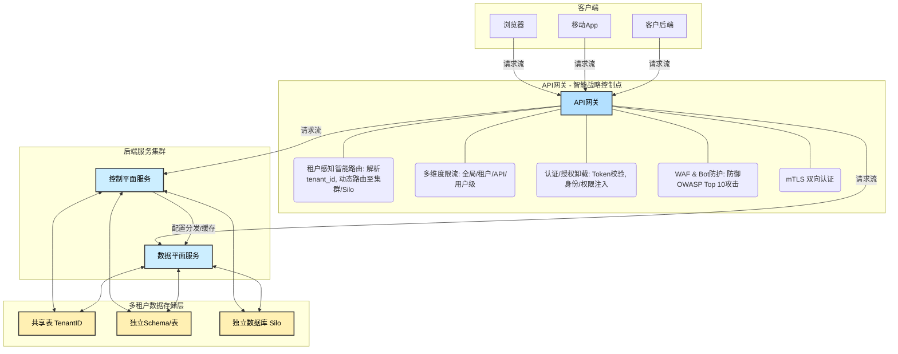

+++
mermaid = true
+++
## 第20篇：【架构篇】IDaaS架构的“试金石”：驾驭多租户、API与高可用的三重挑战

多租户（Multi-tenancy）和API优先（API-First）是IDaaS的两大基石。但对于平台构建者而言，真正的挑战在于：**如何在这两大基石之上，构建真正意义上的高可用性、弹性和安全性？**

### 1\. 多租户架构：从“逻辑隔离”到“命运共同体”的管理艺术

多租户是IDaaS的商业模式基石，但在技术上，它是一把双刃剑。它在带来成本效益的同时，也引入了“命运共同体”的风险——例如，一个租户的资源滥用、性能瓶颈或安全漏洞可能会通过共享基础设施波及其他所有租户。因此，系统设计的核心目标是：**在共享资源的前提下，实现最大程度的故障隔离和性能隔离。**

#### 1.1 系统设计者的第一个抉择：隔离模型的“不可能三角”

数据隔离是多租户架构的生命线。常见的隔离模型有三种，但它们的选择并非单纯的技术选型，而是商业、成本和风险的综合考量，形成了一个微妙的“不可能三角”。

**\[设计决策点\]** 隔离模型的选择是在隔离性、成本和敏捷性之间的权衡。

| 隔离模型 | 隔离性 (安全性/故障) | 成本 (资源/运维) | 敏捷性 (开发效率/部署速度) | 典型场景 |
| :--- | :--- | :--- | :--- | :--- |
| **独立数据库 (Silo)** | **极高** | **极高** | **低** | 金融、政府等合规性要求极高的客户；超大型企业私有化部署。 |
| **独立Schema/表** | **高** | **中** | **中** | 主流SaaS产品的通用选择，在隔离与成本间取得良好平衡。 |
| **共享表 (TenantID)** | **中** | **低** | **高** | 初创公司、内部平台、对成本极度敏感或租户规模较小的场景。 |

> 真正的挑战在于**数据访问层的抽象**。无论选择哪种模型，应用层代码都应该对底层实现无感知。通过在应用框架中强制注入`TenantContext`，并在ORM/Repository层实现透明的租户ID过滤，可以确保任何业务逻辑代码都无法绕过租户隔离。这是防止灾难性数据泄露的最后一道防线。

#### 1.2 超越数据：控制平面（Control Plane）与数据平面（Data Plane）的隔离

高可用设计不仅仅是数据隔离。一个成熟的IDaaS系统可以被抽象为两个逻辑平面：

  * **控制平面 (Control Plane):** 处理低频但关键的操作。例如，租户管理员配置认证策略、修改品牌UI、管理应用集成、查看审计日志。
  * **数据平面 (Data Plane):** 处理高频、低延迟的核心身份流程。例如，用户登录认证（SSO）、API授权、令牌颁发。

**\[设计决策点\]** 将控制平面与数据平面在架构上解耦，甚至进行物理隔离。

  * **价值：** 控制平面的故障（如管理后台Bug、配置服务不可用）不应影响核心的数据平面（用户登录）。这极大地缩小了故障的“爆炸半径”，是实现高可用性的关键一步。
  * **实现方式：**
      * **配置的“编译与分发”：** 租户在控制平面修改的策略（如新的MFA规则），不应在运行时被数据平面实时查询。而是在保存时被“编译”成高效的只读格式，并异步分发到数据平面的所有节点缓存。
      * **独立的部署单元：** 将控制平面和数据平面部署为不同的微服务集群，使用不同的资源池和伸缩策略。

#### 1.3 租户生命周期管理：被忽视的复杂度

一个成熟的IDaaS平台必须将租户的**Onboarding（入驻）、Migration（迁移）、Offboarding（退租）** 视为一等公民来设计。

  * **自动化入驻：** 通过API（而非手动脚本）创建租户，包括初始化数据库/Schema、生成默认配置、设置资源配额等。这与我们在第17篇中讨论的SCIM协议思想一脉相承。
  * **平滑迁移：** 如何在不同隔离模型之间迁移租户？（例如，一个从小租户成长为大客户，需要从共享表迁移到独立Schema）。这需要预先设计的工具和流程，是衡量平台成熟度的重要指标。
  * **安全退租：** 如何确保租户数据被彻底、合规地删除，同时保留必要的审计记录？这涉及到复杂的异步数据清理和归档任务，对系统设计提出了很高要求。

-----

### 2\. API：从“优先设计”到“平台即产品”的演进

在IDaaS领域，**API不仅是集成手段，它本身就是核心产品**。平台的价值直接体现在其API的质量、稳定性和可扩展性上。

#### 2.1 设计一个“统一身份API平面”

一个IDaaS平台通常需要提供三类API，它们有不同的消费者和安全要求：

1.  **标准协议API (The Standards):** 实现OIDC, SAML, SCIM等标准协议的端点。这是平台的“通用语言”，面向所有应用开发者。
2.  **管理API (The Control):** 供租户管理员使用的API，用于配置租户、管理用户、应用等。这是IDaaS的“控制台”，是自动化运维的基础。
3.  **可扩展API (The Extensibility):** 允许客户注入自定义逻辑的API，如Webhooks、自定义认证流程脚本（类似Auth0 Actions/Rules）。这是平台实现差异化和构建生态的关键。

> 这三类API应通过统一的API网关暴露，但背后由不同的微服务承载，并应用不同的安全策略。例如，协议API面向海量匿名请求，需要极强的DDoS防护和性能；管理API则需要基于管理员角色的精细化权限控制。

#### 2.2 API设计的“向后兼容”与“向前演进”

API的版本控制是基础，但真正的挑战在于如何在不中断数千个客户集成的情况下进行演进。

  * **版本化策略：** URL版本化 (`/v2/users`) vs. Header版本化 (`Accept: application/vnd.myapi.v2+json`)。前者更直观，后者对URL污染更小，更符合REST理念。
  * **非破坏性变更：** 始终只在响应中增加新的字段，不删除或重命名字段。请求体中接受新字段，但旧字段依然有效。
  * **弃用策略 (Deprecation Policy)：** 清晰地定义API版本的生命周期（如：Active -\> Deprecated -\> Sunset），并通过响应Header、文档和客户通知进行充分沟通。

**\[设计决策点\]** 为关键流程设计 **“数据转换层”** 。在API网关或后端服务中，可以引入一个适配器层，当v2 API收到v1格式的请求时，能自动将其转换为v2格式，反之亦然。这为客户迁移提供了更长的缓冲期，是顶级SaaS公司的常见实践。

-----

### 3\. API网关：从“流量入口”到“智能战略控制点”

API网关在IDaaS架构中的角色远比路由和限流更为战略性。它是**策略执行点（Policy Enforcement Point - PEP）**，是实现多租户隔离和高可用性的核心枢纽。

#### 3.1 租户感知的智能路由与限流

  * **动态路由：** 网关需要解析请求（如从Host, JWT, API Key中）识别出`tenant_id`，然后根据租户的隔离模型和状态，将请求路由到正确的后端集群。例如，VIP租户的请求可能被路由到专享的“Silo”集群。
  * **多维度限流：**
      * **全局限流：** 保护整个平台免受攻击。
      * **租户级限流：** 防止“吵闹的邻居”（Noisy Neighbor），一个租户的流量洪峰不应影响其他租户。
      * **API级限流：** 对特定高成本API（如用户批量导入）进行更严格的限制。
      * **用户级限流：** 防止单个用户的凭证填充攻击。

#### 3.2 安全责任的“前置”与“卸载”

API网关是安全的第一道防线，它可以将通用的安全逻辑从后端微服务中“卸载”出来，让后端服务更专注于业务逻辑。

  * **认证/授权卸载：** 网关负责校验所有API请求的Token（如OAuth Access Token），并将验证后的用户身份和权限信息（如`user_id`, `tenant_id`, `scopes`）通过HTTP Header注入到上游请求中。后端服务可以信任这些Header，从而简化自身逻辑。这正是我们在第12篇中介绍的PBAC/XACML中PEP的经典实现。
  * **WAF & Bot防护：** 集成Web应用防火墙，防御SQL注入、XSS等OWASP Top 10攻击。
  * **mTLS：** 对需要更高安全性的合作伙伴API或内部服务间调用，强制执行双向TLS认证。

-----

### 总结：系统设计是一门权衡的艺术

构建一个高可用的IDaaS平台，本质上是在**隔离性、成本、性能和敏捷性**之间进行持续的、动态的权衡。

  * **多租户模型**定义了平台的成本结构和故障“爆炸半径”。
  * **API设计**决定了平台的集成能力和长期“可演进性”。
  * **API网关**则是将两者粘合起来，实施安全、隔离和流量策略的“战略控制点”。

一个卓越的IDaaS系统设计，并非因为使用了最时髦的技术，而是因为它在这些复杂的权衡中找到了最适合其当前业务阶段和未来发展的**平衡点**。它不仅承认复杂性，更通过优雅的抽象和解耦，将其转化为驾驭挑战、实现业务价值的强大能力。

**下一篇预告：** 在我们构建了坚实的平台架构后，我们将深入探讨其“免疫系统”。在下一篇文章中，我们将深入探讨IAM系统自身的“护城河”——安全架构设计中的关键考量。

**欢迎关注+点赞+推荐+转发**