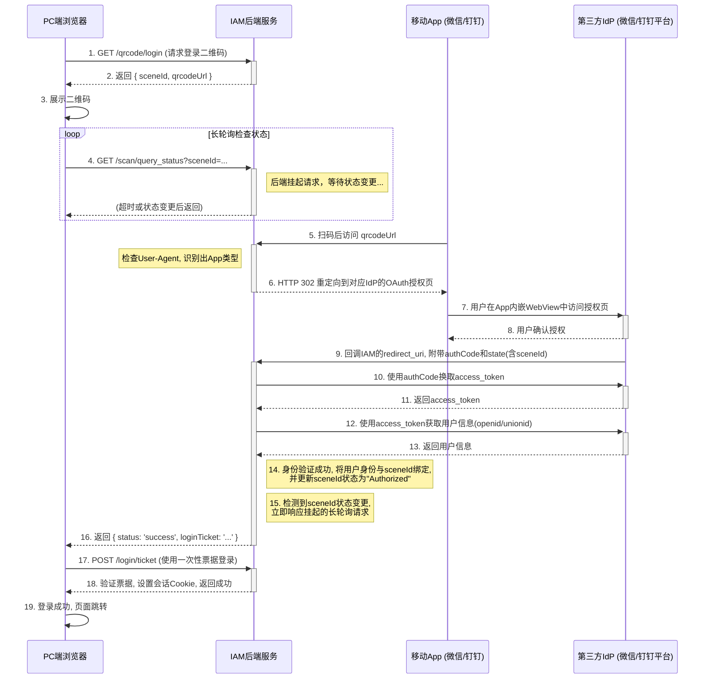

+++
mermaid = true
+++
## **第29篇：【解决方案】统一扫码登录：单码多能的原理与实现**

### **导言**

在移动优先的时代，扫码登录已成为用户体验的标配。然而，传统的扫码登录通常是“单对单”的，例如，微信的二维码只能由微信App扫描。为了追求极致的用户便捷性，现代IAM/IDaaS平台正在探索一种更高级的模式——**统一扫码登录**。

其核心目标是：在PC端的登录页面上只展示**一个动态二维码**，但这个二维码可以被**多个不同的App（如微信、钉钉、企业自有App）** 同时识别和扫描，并最终完成PC端的安全登录。

这种“单码多能”的体验背后，是一套涉及前端、后端、移动App和轮询机制的精密协作流程。本章将深入剖析统一扫码登录的实现原理，并结合序列图，重点关注以下核心环节：

1.  **二维码的生成与内容设计。**
2.  **扫码后的User-Agent识别与智能分发。**
3.  **App端授权与身份上报。**
4.  **PC端轮询与会话建立的闭环。**

### **一、 核心架构与交互时序**

为了清晰地理解整个流程，我们使用序列图来可视化各个组件之间的通信。



### **二、 技术实现细节剖析**

#### **1. 二维码的设计**

二维码不能是静态的。它必须包含一个由IAM后端生成的、动态且唯一的**场景ID（`sceneId`）**。

*   **二维码内容（URL）：** `https://iam.mycompany.com/scan/login?sceneId=UNIQUE_SCENE_ID`
*   **`sceneId`的特点：**
    *   **唯一性：** 每个登录会话都生成一个新的`sceneId`。
    *   **时效性：** 二维码应有较短的有效期（如2-5分钟），`sceneId`在后端也应有对应的过期时间。
    *   **状态管理：** `sceneId`在后端需要维护一个状态机，例如：`PendingScan` -> `Scanned` -> `Authorized` -> `Completed`。

#### **2. User-Agent识别与智能分发（Agent识别）**

这是实现“单码多能”的**技术核心**。当移动App的WebView访问上述URL时，其HTTP请求头中的`User-Agent`会暴露App的身份。

*   **微信 `User-Agent` 示例：**
    `... MicroMessenger/8.0.2 ...`
*   **钉钉 `User-Agent` 示例：**
    `... DingTalk/6.5.30 ...`

**IAM后端的处理逻辑（伪代码）：**

```
function handleScanLoginRequest(request) {
  // 1. 从URL中获取 sceneId
  sceneId = request.query.sceneId;
  // 2. 校验 sceneId 的有效性和状态
  if (!isValid(sceneId) || getState(sceneId) != "PendingScan") {
    return showErrorPage("二维码已失效");
  }

  // 3. 检查 User-Agent
  userAgent = request.headers['User-Agent'];
  
  // 4. 更新 sceneId 状态
  updateState(sceneId, "Scanned");

  // 5. 根据 User-Agent 进行重定向
  if (userAgent.includes("MicroMessenger")) {
    // 构造微信的OAuth授权URL
    redirectUrl = buildWeChatOAuthUrl(sceneId);
    return redirectTo(redirectUrl);
  } else if (userAgent.includes("DingTalk")) {
    // 构造钉钉的OAuth授权URL
    redirectUrl = buildDingTalkOAuthUrl(sceneId);
    return redirectTo(redirectUrl);
  } else {
    // 对于无法识别的客户端，显示一个错误或引导页面
    return showErrorPage("请使用微信或钉钉扫描");
  }
}
```

#### **3. App端授权与身份上报**

此步骤完全遵循各开放平台的标准OAuth 2.0流程。IAM平台在此处扮演的是一个**OAuth客户端**的角色。

*   **回调地址（`redirect_uri`）：** IAM需要为接收微信和钉钉的回调准备不同的端点，或者在同一个端点中通过参数区分。
*   **`state`参数：** 在构造OAuth授权URL时，可以将`sceneId`作为`state`参数传递。这样在回调时，IAM可以确保请求的连续性，并将获取到的用户身份与正确的PC端会话关联起来。

#### **4. PC端轮询与会话建立**

PC端在展示二维码后，必须有一种机制来“得知”移动端的操作已完成。长轮询（Long Polling）是实现此功能的常用技术。

*   **轮询请求：** `GET /scan/query_status?sceneId=UNIQUE_SCENE_ID`
*   **后端处理逻辑：**
    1.  收到轮询请求后，后端并不立即返回，而是检查`sceneId`的状态。
    2.  如果状态仍是`PendingScan`或`Scanned`，则将请求**挂起（Hold）** 一段时间（如25秒）。
    3.  如果在挂起期间，`sceneId`的状态被移动端的操作更新为`Authorized`，则后端立即向这个被挂起的请求返回成功响应。
    4.  成功响应中应包含一个**一次性使用的登录票据（One-Time Ticket）**。
    5.  如果挂起超时，`sceneId`状态仍未改变，则返回一个表示“继续轮询”的空响应。
*   **PC端处理逻辑：**
    1.  收到成功响应后，从响应中提取登录票据。
    2.  向IAM的另一个端点（如`/login/ticket`）提交该票据，以建立正式的浏览器会话（通常是设置Cookie）。
    3.  会话建立后，页面刷新或跳转到用户主页。

### **总结**

统一扫码登录方案，通过一个看似简单的二维码，巧妙地融合了多种技术模式，提供了一种极致流畅的登录体验。其成功的关键在于**IAM后端强大的协调与分发能力**：

*   它通过**动态`sceneId`**，将PC端与移动端的操作进行了唯一的关联。
*   它通过**`User-Agent`识别**，智能地将来自不同App的请求分发到正确的授权流程。
*   它通过**长轮询机制**，实现了PC端对移动端操作状态的准实时感知，最终完成了整个登录闭环。

该方案不仅是技术的精妙组合，更是以用户为中心的设计思想在身份认证领域的完美体现，极大地降低了用户的登录摩擦，是现代IAM/IDaaS平台提升产品竞争力的重要法宝。

**欢迎关注+点赞+推荐+转发**