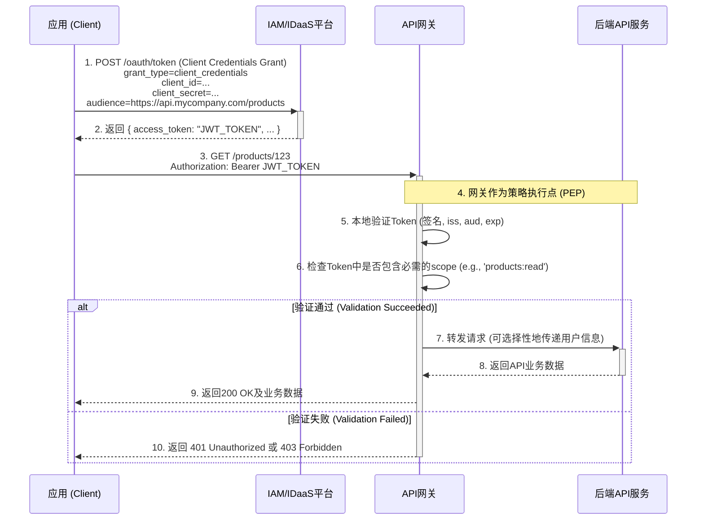

+++
mermaid = true
+++
## **第30篇：【解决方案】新边界：IAM/IDaaS如何治理API安全**

### **导言**

在微服务架构和API经济盛行的今天，应用程序之间的通信（Machine-to-Machine, M2M）流量已远远超过人与应用的交互。API，作为这些通信的契约，构成了企业新的、无形的攻击面。传统的、依赖静态API密钥（API Key）的防护方式，因其凭证固定、权限粗糙、难以轮换和审计等弊端，已无法满足现代零信任安全模型的要求。

为了应对这一挑战，现代IAM/IDaaS平台正在将其治理能力从用户延伸至API，将API安全作为其核心功能之一。它不再仅仅是“人的身份平台”，更是“服务与应用的身份平台”。

本章将深入探讨IAM/IDaaS平台如何通过统一的框架，实现对API的**产品化管理、注册、授权与访问控制**，并重点剖析以下核心环节：

1.  **IAM中的API治理模型：** API产品、注册与授权。
2.  **端到端的M2M授权流程：** 从应用认证到API访问的完整闭环。
3.  **Access Token深度解析：** `aud`, `sub`, `azp`等关键声明的含义。
4.  **与API网关的集成模式：** 实现策略的集中管理与分布式执行。

### **一、 IAM中的API治理模型**

为了对API进行有效的访问控制，IAM平台首先需要能够理解和管理API。这通过一个三层模型实现：

1.  **API注册（资源服务器定义）：**
    *   **做什么：** API的开发者或所有者，需要将其API作为一个“资源服务器”（Resource Server）注册到IAM平台中。
    *   **核心配置：**
        *   **API标识符（Identifier / Audience）：** 为API定义一个全局唯一的URI，例如 `https://api.mycompany.com/products`。这将作为令牌中的`aud`（Audience）声明，确保令牌是“发给”这个特定API的。
        *   **定义权限（Scopes）：** 定义该API暴露的细粒度权限。例如，`products:read`（读取产品信息）、`products:write`（修改产品信息）。

2.  **API产品化管理：**
    *   **做什么：** 将一组相关的API资源和权限打包成一个逻辑上的“API产品”，供应用开发者申请。这是一种业务抽象，简化了授权管理。
    *   **示例：**
        *   **产品名称：** “只读产品目录API”
        *   **包含的API：** `https://api.mycompany.com/products`
        *   **授予的Scope：** `products:read`

3.  **应用授权（客户端申请）：**
    *   **做什么：** 需要访问API的应用程序（客户端），其开发者在IAM平台上为其应用申请访问某个“API产品”。
    *   **结果：** 审核通过后，IAM平台会为该应用生成`client_id`和`client_secret`，并记录下该应用被授权访问`https://api.mycompany.com/products`这个API，且只拥有`products:read`权限。

### **二、 端到端的M2M授权与访问流程**

当上述模型配置完成后，一个典型的M2M调用流程如下。我们使用序列图来清晰地展示这个过程。

### **三、 Access Token深度解析：JWT声明的含义**

在M2M场景中，由IAM颁发的Access Token（通常是JWT格式）是安全的核心。理解其内部声明对于实现正确的访问控制至关重要。

*   **`iss` (Issuer):**
    *   **含义：** 令牌的颁发者。必须是IAM平台自身的、可信的标识符。
    *   **作用：** API网关用此来确认令牌是由合法的IAM平台颁发的。

*   **`sub` (Subject):**
    *   **含义：** 令牌的主体。在客户端凭证模式（Client Credentials Grant）中，**`sub`就是发起请求的应用的`client_id`**。
    *   **作用：** 标识出“谁”在访问API，是审计和日志记录的关键字段。

*   **`aud` (Audience):**
    *   **含义：** 令牌的预期接收方。**其值必须与被调用API在IAM中注册的唯一标识符完全匹配**。
    *   **作用：** 这是防止令牌重放攻击的核心机制。一个为“产品API”颁发的令牌，如果被用去访问“订单API”，API网关会因为`aud`不匹配而拒绝该请求。

*   **`azp` (Authorized Party):**
    *   **含义：** 被授权方。在客户端凭证模式中，**`azp`的值与`sub`相同，都是应用的`client_id`**。它明确指出了是哪个客户端被授权获取了此令牌。
    *   **作用：** 在更复杂的代理（delegation）场景中，`azp`和`sub`可能会不同，但在此M2M流程中，它们共同指明了请求的发起方。

*   **`scope` (Scope):**
    *   **含义：** 权限范围。一个以空格分隔的字符串，列出了此令牌被授予的所有细粒度权限（如`products:read`）。
    *   **作用：** API网关在验证令牌有效性后，还必须检查`scope`声明中是否包含当前请求所需的操作权限。例如，一个`DELETE`请求必须要求令牌中包含`products:write`或`products:delete`之类的scope。

### **四、 与API网关的集成模式**

IAM平台作为策略决策点（PDP），而API网关作为策略执行点（PEP）。它们之间的集成模式决定了验证的效率和灵活性。

*   **模式一：本地JWT验证（首选）**
    *   **描述：** API网关获取IAM平台的公钥（通常通过JWKS - JSON Web Key Set - 端点），并在本地完成对JWT签名的验证。
    *   **优点：** 性能极高，无需每次请求都与IAM进行网络通信。
    *   **实现：** 主流API网关（如Kong, Apigee, NGINX Plus, AWS API Gateway）都提供内置的JWT验证插件或策略，只需配置IAM的JWKS地址和预期的`iss`, `aud`值即可。

*   **模式二：远程Token自省（Introspection）**
    *   **描述：** API网关每次收到请求时，都调用IAM平台的Token自省端点（RFC 7662），将Access Token发送给IAM进行在线验证。
    *   **优点：** 可以处理非JWT格式的不透明令牌（Opaque Token），并且能够实时地检查令牌是否已被吊销。
    *   **缺点：** 性能开销较大，给IAM平台带来额外压力，并增加了请求延迟。

### **总结**

通过将API安全全面纳入治理体系，IAM/IDaaS平台完成了其角色的关键演进。它不再仅仅管理人，更管理着机器与服务。通过**API产品化管理、标准化的OAuth 2.0授权流程、内容丰富的JWT令牌以及与API网关的无缝集成**，IAM平台为企业构建了一个集中、一致、可审计的API安全新边界。这种模式用动态、短生命周期的令牌取代了静态、高风险的API密钥，为零信任架构下的M2M通信提供了坚实可靠的身份与访问管理基石。

**欢迎关注+点赞+推荐+转发**