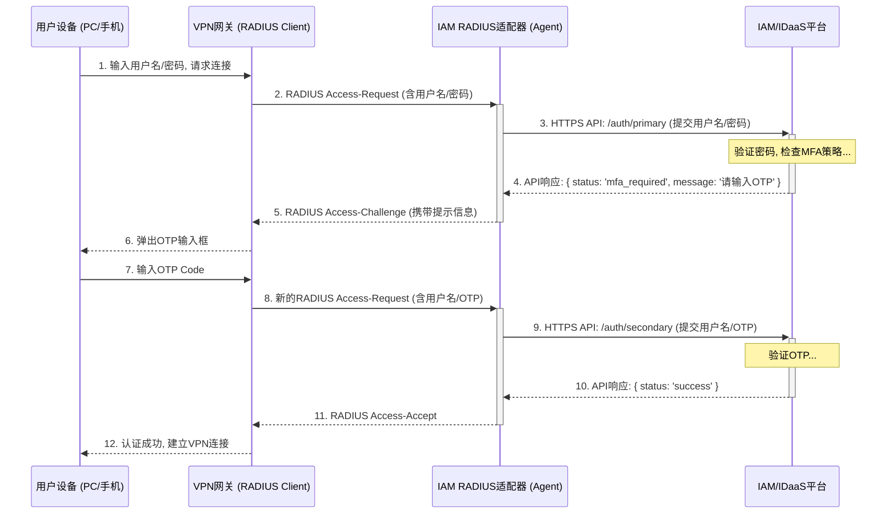

+++
mermaid = true
+++
## **第33篇：【解决方案】赋能传统网络：IAM平台如何支持RADIUS MFA**

### **导言**

在企业的网络基础设施中，VPN网关、Wi-Fi控制器、交换机和防火墙等大量关键设备，其认证机制都深深地根植于一个经典协议——RADIUS（远程身份验证拨入用户服务）。然而，这些设备自身的认证能力通常仅限于用户名和密码，难以满足现代零信任安全模型对多因素认证（MFA）的强制要求。

为了弥补这一安全短板，现代IAM/IDaaS平台提供了一种创新的解决方案：**将自身打造为一个支持MFA的、企业级的RADIUS服务端**。这种模式并非要取代现有的RADIUS基础设施，而是要**拦截**和**增强**它。

通过这种集成，企业可以实现：

*   **集中化的MFA策略：** 为VPN、Wi-Fi等所有网络接入点，统一强制执行IAM平台中定义的MFA策略。
*   **丰富的MFA选项：** 将IAM平台支持的各种MFA方式（如TOTP、短信、推送通知、生物识别）无缝应用于RADIUS认证。
*   **统一的审计与日志：** 将网络接入的认证日志与应用认证日志汇集于IAM平台，形成完整的用户行为画像。

本章将深入剖析IAM平台作为RADIUS MFA服务端的实现架构、认证流程以及关键配置要点。

### **核心架构与交互时序**

在此架构中，IAM/IDaaS平台通过一个部署在企业内网的 **“IAM RADIUS适配器（Agent）”** 来扮演RADIUS服务端的角色。这个适配器是协议转换的核心桥梁。

以下序列图详细展示了以“密码+OTP”为例的完整认证流程。

### **认证工作流程详解**

#### **阶段一：主认证（Primary Authentication）**

1.  **用户发起连接：** 用户在其VPN客户端中输入用户名和密码，点击连接。
2.  **RADIUS请求：** VPN网关将用户名和密码封装成一个`Access-Request`消息，发送给已配置好的IAM RADIUS适配器。
3.  **API调用：** 适配器收到请求后，调用IAM平台的**主认证API**，并传递用户名和密码。
4.  **密码验证与MFA决策：** IAM平台收到API请求，根据其内部策略验证密码（可能是在自身目录中验证，或通过代理认证到后端的AD）。密码验证成功后，IAM的策略引擎检查该用户/应用是否需要强制MFA。假设需要。
5.  **RADIUS质询：** IAM平台向适配器返回一个“需要MFA”的决策。适配器将此决策翻译成一个标准的`Access-Challenge`消息，并将其发送回VPN网关。该消息中通常包含提示文本，如“请输入您的6位验证码”。
6.  **用户侧提示：** VPN客户端收到`Access-Challenge`后，会弹出一个新的输入框，向用户显示上述提示文本。

#### **阶段二：次认证（Secondary Authentication - MFA）**

7.  **用户输入MFA码：** 用户查看其Authenticator App，将获取到的6位OTP输入到VPN客户端的提示框中。
8.  **新的RADIUS请求：** VPN网关将用户名和用户刚刚输入的**OTP码**（此时密码字段为空）封装成一个**新的`Access-Request`** 消息，再次发送给IAM RADIUS适配器。
9.  **API调用：** 适配器收到这个新的请求后，识别出这是一个MFA验证阶段，随即调用IAM平台的**次认证/MFA验证API**，并传递用户名和OTP码。
10. **MFA验证：** IAM的MFA服务验证该OTP码的有效性。
11. **RADIUS接受：** 验证通过后，IAM向适配器返回“认证成功”的决策。适配器将此决策翻译成一个`Access-Accept`消息，发送给VPN网关。
12. **接入成功：** VPN网关收到`Access-Accept`后，认为用户身份已完全验证，正式建立VPN隧道，允许用户接入网络。

### **高级特性与考量**

*   **MFA推送通知（Push Notification）：** 对于支持推送的MFA，流程会更简化。在阶段一结束后，IAM平台直接向用户的手机App发送一个推送请求。用户在手机上点击“批准”后，IAM后台会更新认证状态。适配器可以通过一个短轮询或回调机制得知状态变化，并直接向VPN网关发送`Access-Accept`，从而省去了用户手动输入OTP的步骤。
*   **高可用性（HA）：** RADIUS适配器是关键路径上的核心组件，必须以主备或集群方式部署，以避免单点故障。
*   **RADIUS属性传递：** 成熟的IAM解决方案，允许管理员根据用户的属性或所属的用户组，在最终的`Access-Accept`消息中动态返回特定的RADIUS属性（如`Filter-Id`, `Tunnel-Private-Group-ID`等）。这可以实现对不同用户分配不同网络策略（如VLAN、访问控制列表）的精细化授权。

### **总结**

将IAM/IDaaS平台作为RADIUS MFA服务端，是典型的用现代身份技术赋能和加固传统基础设施的解决方案。通过一个轻量级的**RADIUS适配器**作为桥梁，成功地将IAM平台强大的**集中化策略管理能力**和**多样化的MFA认证能力**，无缝地注入到了企业现有的VPN、Wi-Fi等网络接入体系中。

这种集成模式不仅极大地提升了传统网络接入的安全性，更重要的是，它将用户的网络行为纳入了IAM的统一身份治理范畴，实现了真正意义上的全场景身份安全闭环。对于任何致力于构建零信任架构的企业而言，这都是不可或缺的一环。

**欢迎关注+点赞+推荐+转发**