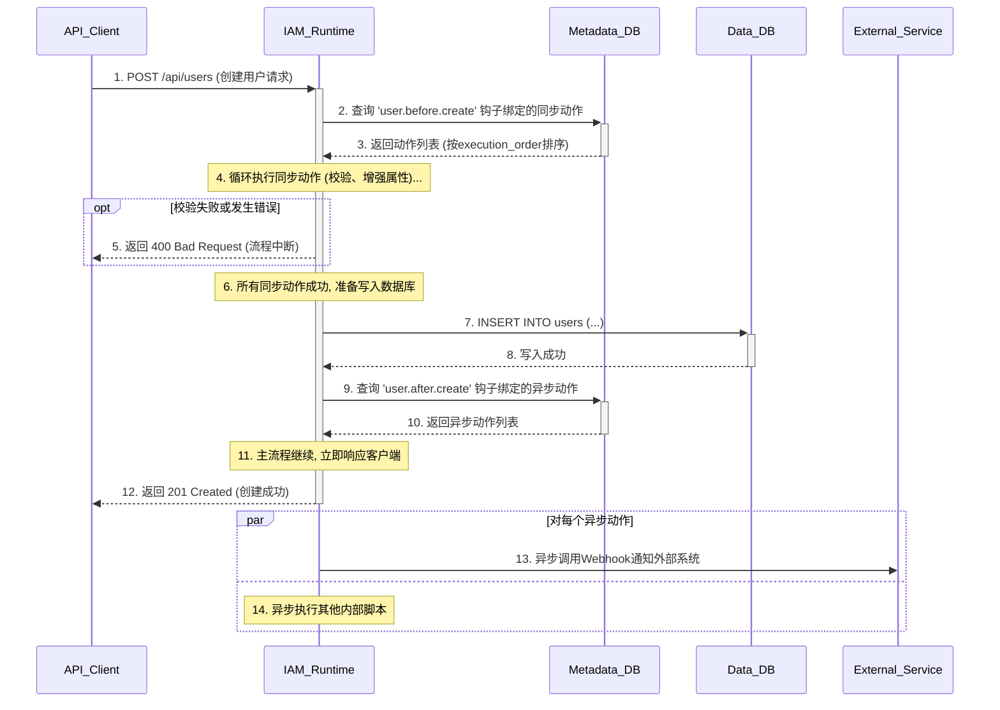

## **第35篇：【架构蓝图】IDaaS中可扩展业务流程的实现原理**

### **导言**

在上一章中，我们探讨了IDaaS平台如何通过元数据驱动的架构，实现对任意对象和属性的灵活定义。然而，一个真正的平台不仅要能定义“是什么”（对象），更要能定义“做什么”（流程）。当一个用户被创建、一个设备被注册、或一次敏感的认证发生时，企业往往需要注入其独特的业务逻辑——可能是数据校验、是属性增强、或是对下游系统的异步通知。

传统的IAM系统将这些流程硬编码在系统内部，无法满足企业个性化的需求。而现代IDaaS平台则通过一个**可扩展的、事件驱动的“钩子”（Hook）系统**，将自身的核心流程开放出来，允许租户管理员或开发者注入自定义逻辑。

本章将深入IDaaS平台架构的内部，解构这个强大的业务流程引擎是如何实现的，重点关注：

1.  **核心架构：** 事件、钩子与动作的元数据模型，以及自定义对象钩子的动态生成机制。
2.  **运行时引擎：** 系统如何发现并执行这些自定义逻辑。
3.  **应用场景：** 如何将其应用于对象生命周期和核心认证流程。

### **核心架构之一：流程的元数据模型与动态钩子生成**

可扩展流程的基石，是一个强大的元数据管理层。它不仅定义了系统中所有可被“挂接”的事件点，更关键的是，它具备为**全新的自定义对象动态生成这些事件点**的能力。

#### **元数据核心表结构**

*   **`hooks` 表：** 定义系统中所有可用的“钩子”（即事件触发点）。
    ```sql
    CREATE TABLE hooks (
        id INT PRIMARY KEY AUTO_INCREMENT,
        name VARCHAR(255) UNIQUE NOT NULL, -- e.g., "user.before.create", "pre.authentication"
        description TEXT,
        payload_schema JSON                 -- 定义此钩子触发时，会向动作传递哪些上下文数据
    );
    ```

*   **`custom_logics` 表：** 定义租户创建的、可被复用的“动作”或“逻辑单元”。
    ```sql
    CREATE TABLE custom_logics (
        id INT PRIMARY KEY AUTO_INCREMENT,
        tenant_id INT NOT NULL,
        name VARCHAR(255) NOT NULL,
        logic_type VARCHAR(50) NOT NULL,    -- 'WEBHOOK', 'INLINE_SCRIPT', 'VALIDATION_RULE'
        config JSON NOT NULL,               -- 存储具体配置, 如Webhook URL, 脚本内容, 校验表达式等
        UNIQUE(tenant_id, name)
    );
    ```

*   **`trigger_bindings` 表：** 这是将“钩子”与“动作”绑定在一起的“触发器”表。
    ```sql
    CREATE TABLE trigger_bindings (
        id INT PRIMARY KEY AUTO_INCREMENT,
        tenant_id INT NOT NULL,
        hook_id INT,                        -- Foreign key to hooks
        logic_id INT,                       -- Foreign key to custom_logics
        execution_order INT NOT NULL,       -- 同一个钩子可以绑定多个动作，此字段定义其执行顺序
        is_synchronous BOOLEAN NOT NULL,    -- 关键：定义此动作为同步执行还是异步执行
        is_enabled BOOLEAN DEFAULT TRUE
    );
    ```

#### **自定义对象钩子的动态生成机制**

这是体现平台灵活性的核心。当管理员定义一个新的自定义对象时，系统会自动为其创建一整套标准的生命周期钩子。

1.  **用户操作：** 管理员通过UI或API，创建一个新的自定义对象类型，例如“IoT设备”，其`api_name`为`iot_device`。
2.  **系统内部逻辑：**
    *   在`object_types`元数据表中创建一条新记录。
    *   **触发钩子生成器（Hook Generator）：** 该记录成功创建后，系统内部的一个自动化逻辑被触发。
    *   **应用模板生成钩子：** 这个生成器会应用一个预定义的生命周期事件模板，如：
        *   `[object_api_name].before.create`
        *   `[object_api_name].after.create`
        *   `[object_api_name].before.update`
        *   ...等等
    *   **注册新钩子：** 生成器用`iot_device`替换模板中的占位符，并自动向`hooks`元数据表中插入一组新的记录（如`name`为`"iot_device.before.create"`）。

通过这个机制，任何自定义对象都天然地、无需额外开发地具备了与内置对象（如用户）同等水平的、可被集成的能力。


### **核心架构之二：运行时引擎 (The Runtime Engine)**

运行时引擎是执行这些自定义逻辑的核心。当一个业务操作发生时，它会拦截该操作，查询元数据，并按顺序执行绑定的逻辑。

##### **执行流程序列图**

以下序列图展示了当一个API请求创建一个新用户时，运行时引擎的工作流程。



### **核心架构之三：应用场景与示例**

#### **场景一：对象生命周期钩子**

这允许将业务逻辑注入到任何对象（无论是内置的还是自定义的）的CRUD操作中。

*   **校验阻断（同步）：**
    *   **钩子：** `user.before.create`
    *   **动作类型：** `VALIDATION_RULE`
    *   **逻辑：** 配置一条规则，检查用户输入的`employeeId`是否符合公司`"FT[0-9]{6}"`的格式。如果不符合，动作返回失败，运行时引擎将中断整个创建流程，并向API调用者返回错误。

*   **属性增强（同步）：**
    *   **钩子：** `user.before.create`
    *   **动作类型：** `INLINE_SCRIPT`
    *   **逻辑：** 执行一段脚本，自动将输入的`firstName`和`lastName`拼接起来，并赋值给`displayName`属性。这个增强后的用户对象将被存入数据库。

*   **异步通知（异步）：**
    *   **钩子：** `device.after.create` (一个自定义对象)
    *   **动作类型：** `WEBHOOK`
    *   **逻辑：** 当一个新设备在IDaaS中注册成功后，运行时引擎会异步地调用一个配置好的Webhook URL，将新设备的ID和序列号等信息推送到企业的CMDB或资产管理系统中。

#### **场景二：核心认证流程钩子**

这允许在认证的关键节点上，实施动态的、上下文感知的安全策略。

*   **认证前-风险评估（同步）：**
    *   **钩子：** `pre.authentication`
    *   **逻辑：** 在校验用户密码**之前**触发。可以调用一个`INLINE_SCRIPT`或`WEBHOOK`，将请求的IP地址、设备指纹等信息发送到一个第三方的风险评估引擎。如果返回“高风险”，则直接中断认证流程。

*   **认证后-动态MFA（同步）：**
    *   **钩子：** `post.authentication.primary` (主认证，如密码验证成功后)
    *   **逻辑：** 此时已知用户身份。可以执行一个脚本，检查该用户的属性（如`user.contract_type == '外包'`）或所属的组。如果满足特定条件，即使全局MFA策略未要求，也可以动态地强制用户必须完成MFA才能继续。

*   **应用访问前-实时授权（同步）：**
    *   **钩子：** `pre.sso.generation`
    *   **逻辑：** 在为用户生成访问应用的SSO令牌**之前**触发。可以调用一个`WEBHOOK`，实时查询一个外部的授权系统（如一个API许可服务器或一个项目管理工具），以确认该用户是否仍然有权限访问该应用。如果外部系统返回“禁止”，则中断SSO流程，向用户显示“您无权访问此应用”。


#### **关于异步任务的简要说明**

在上述架构中，`is_synchronous`字段为`false`的动作将被异步执行。这意味着IDaaS平台的主流程不会等待该动作完成，而是立即向用户或API调用者返回响应，从而保证了核心操作的低延迟。一个健壮的IDaaS平台通常会为关键的异步任务提供“可靠交付”保障，这通常需要一个更复杂的后端系统来支持，包括使用消息队列进行任务持久化、状态跟踪以及失败后的自动重试机制。


### **总结**

通过构建一个**基于元数据的事件驱动钩子系统**，并为其配备**动态钩子生成机制**，IDaaS平台将其内部的核心流程转变为一个可被外部逻辑编排的、开放的框架。这种架构设计，是平台从一个功能固化的SaaS应用，演进为一个真正的**身份流程自动化平台（Identity Process Automation, IPA）** 的根本所在。

它赋予了企业前所未有的灵活性，能够：

*   **无缝集成业务规则：** 将企业独特的校验、审批和数据处理逻辑，深度嵌入到任何对象（包括自定义对象）的生命周期中。
*   **实现动态、上下文感知的安全：** 基于实时的风险、用户属性和外部系统状态，动态调整认证和授权策略。
*   **自动化跨系统工作流：** 以IDaaS中的身份事件为中心，驱动企业内部其他业务系统（如HR、ITSM、CMDB）的流程自动化。

最终，一个具备可扩展业务流程能力的IDaaS平台，才能够真正成为企业数字化转型的“神经中枢”，连接身份，驱动业务。

**欢迎关注+点赞+推荐+转发**