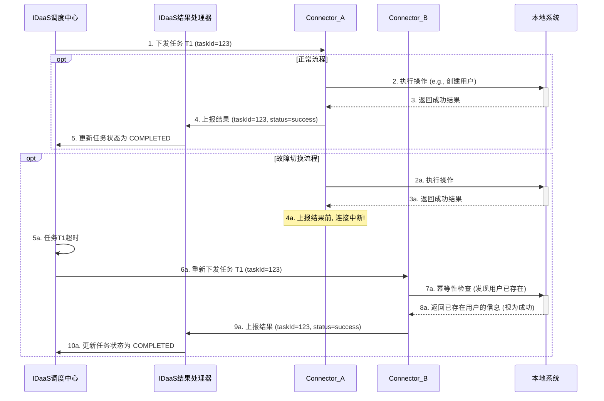

## **第36篇：【架构蓝图】跨越云与本地：IDaaS On-Premises Connector的实现原理**

### **导言**

IDaaS（Identity as a Service）平台以其云原生的灵活性、可扩展性和易用性，正在成为企业身份管理的核心。然而，在绝大多数企业中，大量关键的业务系统和身份存储（如Active Directory、LDAP、本地数据库、内部API）仍然部署在客户的本地数据中心，被层层防火墙所保护。

这就产生了一个核心的架构挑战：**一个云端的IDaaS平台，如何安全、高效、可靠地与一个内网中的本地系统进行双向通信？**

传统的解决方案，如开放防火墙端口或建立复杂的点对点VPN，都带来了巨大的安全风险和运维负担。为了解决这一难题，现代IDaaS平台普遍采用了一种更优雅、更安全的架构——**On-Premises Connector（本地连接器）**，通常以一个轻量级代理（Agent）的形式存在。

本章将深入解构这一核心解决方案的实现原理，并重点剖析其在生产环境中必须解决的**高可用性（HA）**、**云端消息路由**以及**任务结果的可靠上报**等关键问题。

### **核心架构：On-Premises Connector模型**

该模型的核心思想是：**变“云端主动推”为“本地主动拉”**，通过一个由内向外建立的、持久化的安全连接，来规避所有复杂的入向网络策略。

*   **IDaaS平台（云端）：** 作为控制中心和任务的发起方，通常是**集群化部署**的。它承担了所有的智能调度、故障切换和结果处理逻辑。
*   **企业防火墙：** 保持其标准的“拒绝所有入向连接”策略，只需允许常规的出向HTTPS流量（端口443）。
*   **On-Premises Connector (Agent)：** 部署在客户内网服务器上的一个轻量级软件，通常需要**集群化部署**以实现高可用。Agent本身被设计为尽可能**无状态**的。
*   **本地系统（On-Premises Systems）：** 如AD、数据库、内部应用等，只与Connector进行通信。

### **核心技术之一：任务的端到端闭环流程**

一个完整的操作，包含“任务下发”和“结果上报”两个阶段，必须设计成一个可靠的、具备故障自愈能力的闭环系统。

#### **阶段一：任务下发（云端智能调度）**

1.  **Connector组注册：** 在客户内网中，部署两个或多个Connector实例。它们在启动时，都向IDaaS平台注册自己属于同一个**“Connector组”**（例如`Group-G1`）。IDaaS平台因此知道，`G1`组当前有两个或多个健康的、可用的连接。
2.  **任务创建与状态跟踪：** 当一个需要本地执行的操作被触发时（如“在AD中创建用户`jdoe`”），IDaaS首先在其数据库中创建一个**任务记录**，并赋予其一个唯一的`taskId`和初始状态`PENDING`。
3.  **智能调度与单点下发：** IDaaS的**调度中心**从`G1`组的可用连接中，根据某种策略（如轮询）**选择一个**目标连接（如`Connector-A`的连接），并将包含`taskId`的任务下发。同时，调度中心将任务记录的状态更新为`DISPATCHED`，并启动一个超时计时器。

#### **阶段二：结果上报（可靠的异步响应）**

1.  **本地执行：** `Connector-A`接收到任务，在本地执行（如调用LDAP API创建用户）。
2.  **结果封装：** 执行完成后，`Connector-A`将执行结果（成功或失败信息、AD返回的用户SID等）与原始的`taskId`封装在一起。
3.  **通过连接上报：** `Connector-A`通过它与IDaaS建立的同一个持久化连接（WebSocket），将这个结果消息**“推”**回给IDaaS平台。
4.  **云端结果处理：**
    *   持有该连接的IDaaS实例（`IDaaS-Node-1`）接收到结果消息。
    *   它将这个结果消息（包含`taskId`和结果数据）交给一个**内部的结果处理服务**。
    *   结果处理服务根据`taskId`，找到数据库中对应的任务记录。
    *   它将任务状态更新为`COMPLETED`或`FAILED`，并将返回的具体数据（如用户SID）写入到关联的业务数据表中（例如，更新IAM中该用户对象的“AD账户信息”属性）。
    *   最后，它会清除任务的超时计时器。

### **核心技术之二：高可用性与故障切换**

#### **云端集群的消息路由**

在一个集群化的IDaaS环境中，一个来自客户的WebSocket连接只会落在**某一个**IDaaS实例上。但触发任务的API请求可能会被路由到**任何其他**实例上。

**最佳实践：使用外部消息代理的发布/订阅模式**

*   **实现原理：**
    1.  **连接建立与订阅：** 当一个Connector实例（例如`Connector-A`）与IDaaS实例（例如`IDaaS-Node-1`）建立连接时，`IDaaS-Node-1`会去**订阅**一个特定于该Connector的**消息主题/通道**。
    2.  **任务发布：** 当`IDaaS-Node-2`需要向`Connector-A`下发任务时，它只需将任务消息**发布**到`Connector-A`对应的那个主题上。
    3.  **消息代理投递：** 消息代理（如Redis Pub/Sub, RabbitMQ）负责将这条消息，投递给订阅了该主题的`IDaaS-Node-1`。
    4.  **精确推送：** `IDaaS-Node-1`接收到消息后，通过它持有的WebSocket连接将任务精确地推送给`Connector-A`。

#### **本地Connector集群的故障切换**

*   **场景：** IDaaS将任务`T1`发给`Connector-A`后，`Connector-A`成功执行了任务，但在上报结果前，`Connector-A`或其网络连接发生故障。
*   **云端超时与重调度：**
    *   IDaaS的调度中心等待`T1`的超时计时器到期，但仍未收到关于`T1`的任何结果上报。
    *   调度中心将`T1`的状态重新标记为`PENDING`（或`RETRY`），并将其重新放入待调度队列。
    *   在短暂延迟后，调度中心会选择`G1`组中另一个健康的连接（如`Connector-B`的连接），并将**同一个任务`T1`（携带相同的`taskId`）**重新下发。
*   **本地幂等性处理：**
    *   `Connector-B`接收到任务`T1`。其本地执行模块在设计时**必须具备幂等性**。例如，在执行“创建用户`jdoe`”之前，它会先在AD中查询`jdoe`是否存在。
    *   它发现用户`jdoe`已经被`Connector-A`创建了。于是，它不会再次创建，而是直接将查询到的用户信息（如SID）作为“成功”结果，与`taskId`一起上报给IDaaS平台。
    *   IDaaS平台接收到这个“成功”结果，正常地完成后续的数据写入和状态更新，整个流程得以修复并闭环。

#### **序列图：包含结果上报与故障切换的完整流程**

### **总结**

**On-Premises Connector**是现代IDaaS平台解决混合身份管理挑战的基石。要将其从一个概念模型落地为生产级可用系统，必须是一个**可靠的、双向的、具备故障自愈能力的闭环系统**。

*   **任务下发**依赖于**云端的智能调度与故障切换**，将复杂性保留在云端，简化了本地Agent的部署。
*   **结果上报**则通过**持久化连接**和**内部的结果处理服务**，确保了本地执行的结果能够被可靠地反馈回云端并持久化。
*   整个闭环的健壮性，最终依赖于**云端的超时重试机制**和**本地Connector执行逻辑的幂等性设计**的协同工作，共同确保了即使在网络不稳定或部分组件故障的情况下，业务流程也能最终达成一致状态。

这种对端到端流程每一个环节的精心设计，才使得IDaaS平台能够真正安全、可靠地将其能力延伸至企业的本地内网，实现混合云环境下的统一身份治理。

**欢迎关注+点赞+推荐+转发**