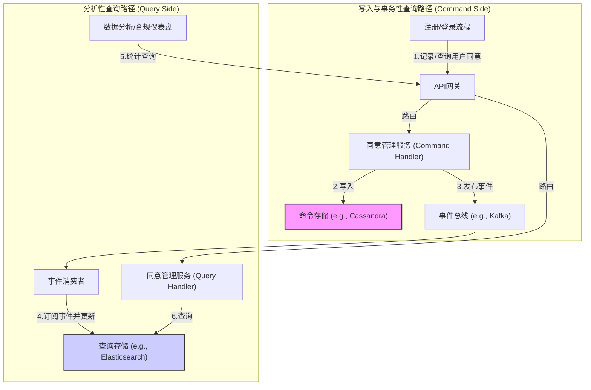
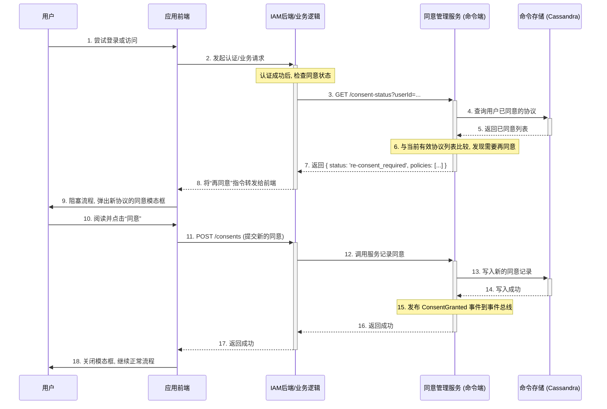

## 第39篇：【架构蓝图】亿级记录下的挑战：CIAM用户协议与同意管理

### **导言**

在CIAM（客户身份与访问管理）领域，**用户同意（Consent）** 是一个需要被精确记录、版本化管理、并可随时审计的、海量的法律证据。当一个拥有数千万用户的平台，其协议经过多次版本更新后，同意记录可轻松突破数亿甚至数十亿条。

这种规模的数据管理，带来了两个核心且相互冲突的查询需求：

1.  **事务性查询（Transactional Query）：** 在用户登录或执行操作时，系统需要**极快地**查询“某个特定用户是否已同意所有必需的协议？”。这是典型的高并发、低延迟的点查询。
2.  **分析性查询（Analytical Query）：** 运营或合规团队需要进行统计分析，例如：“统计新版隐私协议发布后，接下来10天内，每天有多少用户同意？”。这是典型的聚合查询。

同时，这些同意记录具有**只增不改（Append-Only）**的特性。本章将深入探讨如何通过**CQRS（命令查询职责分离）架构**和专业的数据库选型，来构建一个能同时满足这两种需求的、高伸缩性的用户同意管理系统。

### **架构蓝图：采用CQRS（命令查询职责分离）模式**

为了避免让单一数据库同时承受两种截然不同的负载压力，最佳实践是采用CQRS模式，将系统的**写入/事务性读取**路径与**分析性读取**路径分离。

*   **命令端（Command Side）：** 负责处理所有的数据变更（只增不改的同意记录写入）和高并发的用户单点查询。其存储被优化为**极致的写入性能和主键查询速度**。
*   **查询端（Query Side）：** 负责处理复杂的、多维度的统计和分析查询。其存储被优化为**高效的聚合和扫描性能**。
*   **事件总线（Event Bus）：** 作为两者之间的桥梁。当命令端成功写入一条新的同意记录后，会发布一个`ConsentGranted`事件，查询端订阅此事件并更新自己的数据模型。

#### **CQRS交互流程**

### **核心存储选型深度剖析**

#### **命令端存储：优化写入与查询**

*   **技术选型：NoSQL宽列存储数据库 (Wide-Column Store)**
    *   **代表技术：** Apache Cassandra, Google Cloud Bigtable, ScyllaDB。
    *   **为什么适用：** 采用LSM-Tree架构，为只增不改的同意记录提供了无与伦比的**写入性能**。同时，其基于`user_id`分区键的查询，完美地满足了**事务性点查询**的低延迟要求。

#### **查询端存储：赋能复杂分析**

*   **技术选型：搜索引擎或分析型数据库**
    *   **代表技术：** Elasticsearch, Apache Druid, ClickHouse, 或数据仓库（BigQuery, Redshift）。
    *   **为什么适用：** 内置强大的聚合框架，为多维度的分析查询提供了极致的灵活性和性能，并实现了与事务性负载的**资源隔离**。

#### **架构权衡：为何独立的查询端存储不可或缺？**

试图用单一的命令端存储（如Cassandra）来同时处理分析查询，在技术上是不可行的。主要原因在于**致命的查询模式限制**（无法在不提供`user_id`的情况下高效查询）和**聚合能力缺失**（无法在数据库层面执行`GROUP BY`）。CQRS架构通过为不同的任务选择最专业的工具，从根本上解决了这一矛盾。

### **关键工作流：版本更新后的“再同意” (Re-consent)**

此流程发生在**命令端**，因为它是一个高并发、低延迟的事务性检查。

1.  **发布新版本：** 管理员将新版协议标记为`is_active = true`。
2.  **触发检查：** 用户下一次登录时，业务流程向“同意管理服务”的**命令端**发起检查。
3.  **后端逻辑：** 服务在**命令端存储**（Cassandra）中，高效地查询该`user_id`已同意的协议列表，并与当前有效的协议列表进行比较。
4.  **返回指令：** 如果发现需要“再同意”，API返回指令。
5.  **前端呈现与记录：** 前端弹出模态框，用户同意后，一条新的同意记录被写入**命令端存储**，并发布`ConsentGranted`事件，最终同步到查询端。

#### **“再同意”工作流时序图**

---

### **总结**

CIAM场景下的用户协议与同意管理，是一个典型的需要**CQRS架构**来解决的工程挑战。

通过将系统职责分离，我们为**命令端**选择了**Cassandra**这类写入和主键查询性能极致的数据库，来承载海量的、只增不改的同意记录，并服务于高并发的在线业务。同时，我们为**查询端**选择了**Elasticsearch**或同类分析引擎，来满足复杂的、多维度的统计和合规报表需求。

这种架构不仅从根本上解决了单一数据库无法同时优化两种冲突查询模式的难题，更构建了一个清晰、健壮、面向未来的海量身份数据处理平台。

**欢迎关注+点赞+推荐+转发**